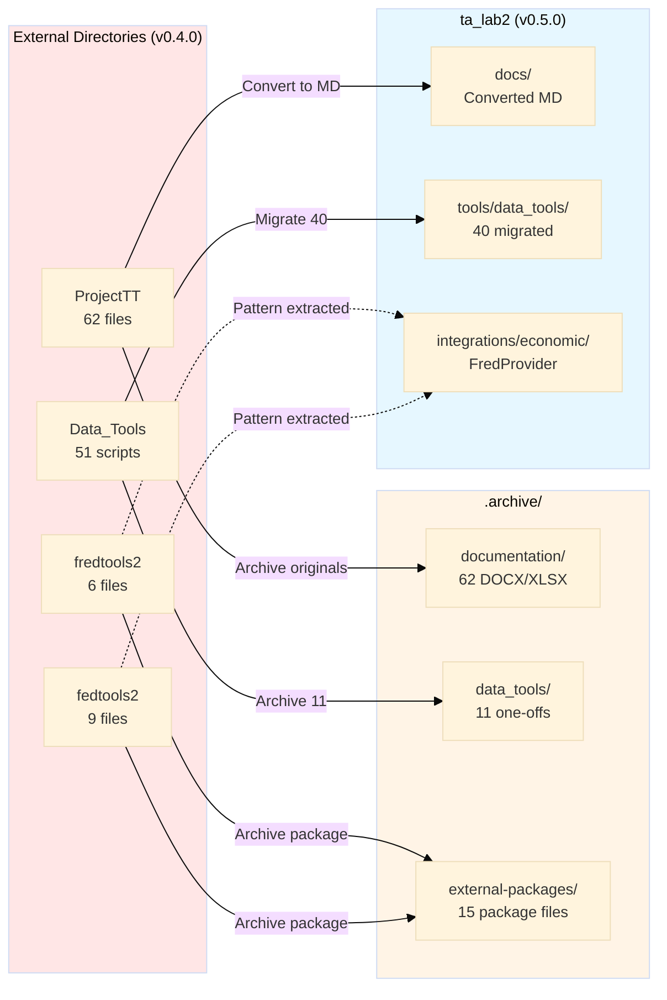
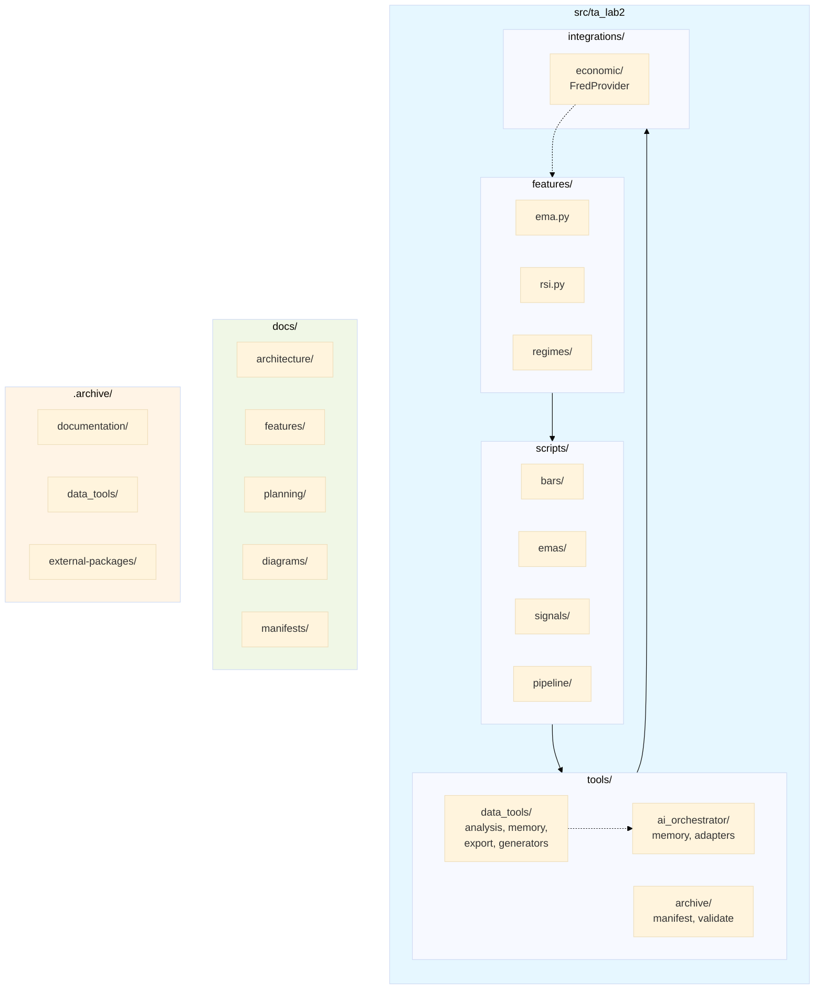

<objective>
Generate before/after directory tree diagrams and Mermaid visualizations documenting the v0.5.0 reorganization.

Purpose: Provide both detailed (ASCII trees) and high-level (Mermaid) views of what changed during reorganization.
Output: docs/diagrams/ directory with before_tree.txt, after_tree.txt, data_flow.mmd, package_structure.mmd
</objective>

<execution_context>
@./.claude/get-shit-done/workflows/execute-plan.md
@./.claude/get-shit-done/templates/summary.md
</execution_context>

<context>
@.planning/PROJECT.md
@.planning/ROADMAP.md
@.planning/STATE.md

# Phase 18 research with code examples
@.planning/phases/18-structure-documentation/18-RESEARCH.md
@.planning/phases/18-structure-documentation/18-CONTEXT.md

# Phase 12 baseline for "before" state
@.planning/phases/12-archive-foundation/baseline/pre_reorg_snapshot.json

# Current structure for "after" state
</context>

<tasks>

<task type="auto">
  <name>Task 1: Generate before_tree.txt from Phase 12 baseline</name>
  <files>docs/diagrams/before_tree.txt</files>
  <action>
Create ASCII tree showing all 5 directories as they existed at v0.4.0 (pre-reorganization).

1. Create docs/diagrams/ directory

2. Use Phase 12 baseline snapshot to reconstruct "before" state for:
   - ta_lab2/ (308 Python files per baseline)
   - ProjectTT/ (document structure - extract from 13-01 to 13-06 SUMMARYs)
   - Data_Tools/ (51 scripts per 14-01 discovery)
   - fredtools2/ (6 Python files per 15-01)
   - fedtools2/ (9 Python files per 15-01)

3. Generate ASCII tree using box-drawing characters:
```
ta_lab2 Ecosystem (Pre-Reorganization v0.4.0)
=============================================

ta_lab2/
├── src/
│   └── ta_lab2/
│       ├── features/
│       │   ├── __init__.py
│       │   ├── ema.py
│       │   └── ...
│       ├── scripts/
│       │   ├── bars/
│       │   ├── emas/
│       │   └── ...
│       └── tools/
│           └── ai_orchestrator/
└── tests/
    └── ...

ProjectTT/
├── Foundational/
│   ├── CoreComponents.docx
│   ├── KeyTerms.docx
│   └── ...
├── Features/
│   ├── Bars/
│   │   ├── DesriptiveDocuments/
│   │   └── Studies&Scraps/
│   └── EMAs/
│       ├── DesriptiveDocuments/
│       └── Studies&Scraps/
├── Plans&Status/
├── ProcessDocuments/
└── ChatGPT/

Data_Tools/
├── generate_function_map.py
├── tree_structure.py
├── DataFrame_Consolidation.py
└── chatgpt/
    ├── ask_project.py
    ├── generate_memories_from_diffs.py
    └── ... (42 more scripts)

fredtools2/
├── src/
│   └── fredtools2/
│       ├── __init__.py
│       ├── client.py
│       └── utils.py
├── sql/
└── pyproject.toml

fedtools2/
├── src/
│   └── fedtools2/
│       ├── __init__.py
│       ├── fred.py
│       └── utils/
├── tests/
└── pyproject.toml
```

Per 18-CONTEXT.md: "Full depth - all the way down to files" but use sensible truncation for very large directories (show representative files with "..." for 50+ file directories).

Add header with timestamp and note this represents pre-reorg state.
  </action>
  <verify>wc -l docs/diagrams/before_tree.txt | grep -E "^[0-9]{2,}" || (ls -la docs/diagrams/before_tree.txt && echo "Check line count")</verify>
  <done>before_tree.txt shows all 5 directories (ta_lab2, ProjectTT, Data_Tools, fredtools2, fedtools2) with ASCII tree structure representing v0.4.0 state</done>
</task>

<task type="auto">
  <name>Task 2: Generate after_tree.txt showing current structure</name>
  <files>docs/diagrams/after_tree.txt</files>
  <action>
Create ASCII tree showing consolidated ta_lab2 structure after v0.5.0 reorganization.

1. Scan current project structure using pathlib

2. Generate tree showing:
```
ta_lab2 Ecosystem (Post-Reorganization v0.5.0)
==============================================

ta_lab2/
├── .archive/                    # Preserved files
│   ├── deprecated/
│   │   └── manifest.json
│   ├── documentation/
│   │   ├── 2026-02-02/         # 62 ProjectTT files
│   │   └── manifest.json
│   ├── data_tools/
│   │   ├── 2026-02-03/         # 11 archived scripts
│   │   └── manifest.json
│   ├── external-packages/
│   │   └── 2026-02-03/         # fredtools2, fedtools2
│   │       ├── fredtools2/
│   │       ├── fedtools2/
│   │       ├── manifest.json
│   │       └── ALTERNATIVES.md
│   ├── migrated/
│   └── refactored/
├── docs/
│   ├── architecture/           # Converted from ProjectTT
│   ├── features/               # EMA, Bars docs
│   │   ├── bars/
│   │   └── emas/
│   ├── planning/               # Status, plans
│   ├── reference/              # Keys, schemas
│   ├── migration/              # Migration support
│   ├── diagrams/               # NEW: Before/after trees
│   ├── manifests/              # NEW: Decision tracking
│   └── index.md
├── src/
│   └── ta_lab2/
│       ├── features/
│       ├── integrations/
│       │   └── economic/       # NEW: FredProvider
│       ├── scripts/
│       ├── tools/
│       │   ├── ai_orchestrator/
│       │   ├── archive/        # NEW: Archive tooling
│       │   └── data_tools/     # NEW: Migrated from Data_Tools
│       │       ├── analysis/
│       │       ├── context/
│       │       ├── export/
│       │       ├── generators/
│       │       ├── memory/
│       │       └── processing/
│       └── utils/
│           └── economic/       # NEW: Extracted utilities
├── tests/
├── .planning/                   # GSD planning artifacts
├── README.md
└── pyproject.toml
```

Annotate NEW directories that were created during v0.5.0.
Include file counts where helpful (e.g., "62 ProjectTT files").
  </action>
  <verify>test -f docs/diagrams/after_tree.txt && grep -q "archive" docs/diagrams/after_tree.txt && grep -q "data_tools" docs/diagrams/after_tree.txt</verify>
  <done>after_tree.txt shows consolidated structure with .archive/, docs/, migrated tools, and new directories annotated</done>
</task>

<task type="auto">
  <name>Task 3: Create Mermaid data flow diagram</name>
  <files>docs/diagrams/data_flow.mmd</files>
  <action>
Create Mermaid flowchart showing data flow from external directories into ta_lab2.

Following 18-RESEARCH.md Pattern 3:



Key features:
- Shows source counts (62 files, 51 scripts, etc.)
- Distinguishes migration paths (solid arrows) from pattern extraction (dashed arrows)
- Color codes: red (external/old), yellow (archive), blue (new ta_lab2)
  </action>
  <verify>grep -q "flowchart" docs/diagrams/data_flow.mmd && grep -q "External" docs/diagrams/data_flow.mmd && grep -q "Archive" docs/diagrams/data_flow.mmd</verify>
  <done>data_flow.mmd contains Mermaid flowchart showing reorganization flow from external dirs to archive and ta_lab2</done>
</task>

<task type="auto">
  <name>Task 4: Create Mermaid package structure diagram</name>
  <files>docs/diagrams/package_structure.mmd</files>
  <action>
Create Mermaid flowchart showing internal ta_lab2 package organization.



Key features:
- Shows package hierarchy within src/ta_lab2
- Shows relationships between subsystems
- Includes docs/ and .archive/ as related but separate
  </action>
  <verify>grep -q "flowchart" docs/diagrams/package_structure.mmd && grep -q "ta_lab2" docs/diagrams/package_structure.mmd</verify>
  <done>package_structure.mmd contains Mermaid diagram showing internal ta_lab2 package organization with tools, features, integrations</done>
</task>

</tasks>

<verification>
1. docs/diagrams/ directory exists with all 4 files
2. before_tree.txt shows all 5 external directories (ProjectTT, Data_Tools, fredtools2, fedtools2, ta_lab2)
3. after_tree.txt shows consolidated structure with .archive/, docs/, tools/data_tools/
4. data_flow.mmd is valid Mermaid syntax (contains flowchart keyword, subgraphs)
5. package_structure.mmd is valid Mermaid syntax showing internal organization
6. Both ASCII trees have 100+ lines of meaningful content
</verification>

<success_criteria>
- before_tree.txt accurately represents v0.4.0 pre-reorganization state
- after_tree.txt accurately represents v0.5.0 consolidated structure
- Mermaid diagrams render correctly when viewed in GitHub/VS Code
- Diagrams include file counts and annotations where helpful
</success_criteria>

<output>
After completion, create `.planning/phases/18-structure-documentation/18-02-SUMMARY.md`
</output>
