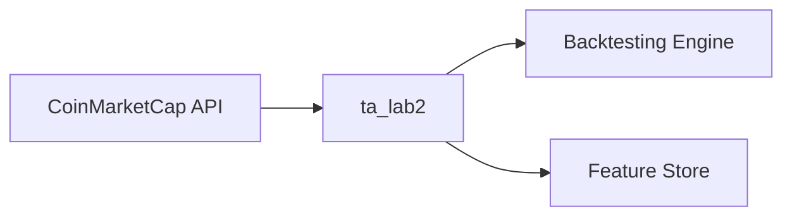
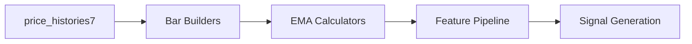

<objective>
Create Script Inventory (RVWD-01) and Data Flow Diagram (RVWD-02)

Purpose: Catalog every bar/EMA script with deep analysis and map the complete data pipeline visually
Output: script-inventory.md (comprehensive table) and data-flow-diagram.md (Mermaid + narrative)
</objective>

<execution_context>
@./.claude/get-shit-done/workflows/execute-plan.md
@./.claude/get-shit-done/templates/summary.md
</execution_context>

<context>
@.planning/PROJECT.md
@.planning/ROADMAP.md
@.planning/STATE.md

# Phase 20 outputs (foundation for analysis)
@.planning/phases/20-historical-context/20-CURRENT-STATE.md
@.planning/phases/20-historical-context/20-HISTORICAL-REVIEW.md

# Phase 21 context and research
@.planning/phases/21-comprehensive-review/21-CONTEXT.md
@.planning/phases/21-comprehensive-review/21-RESEARCH.md

# Source files to analyze (bar builders)
@src/ta_lab2/scripts/bars/refresh_cmc_price_bars_1d.py
@src/ta_lab2/scripts/bars/refresh_cmc_price_bars_multi_tf.py
@src/ta_lab2/scripts/bars/refresh_cmc_price_bars_multi_tf_cal_us.py
@src/ta_lab2/scripts/bars/refresh_cmc_price_bars_multi_tf_cal_iso.py
@src/ta_lab2/scripts/bars/refresh_cmc_price_bars_multi_tf_cal_anchor_us.py
@src/ta_lab2/scripts/bars/refresh_cmc_price_bars_multi_tf_cal_anchor_iso.py
@src/ta_lab2/scripts/bars/common_snapshot_contract.py

# Source files to analyze (EMA refreshers)
@src/ta_lab2/scripts/emas/refresh_cmc_ema_multi_tf_from_bars.py
@src/ta_lab2/scripts/emas/refresh_cmc_ema_multi_tf_v2.py
@src/ta_lab2/scripts/emas/refresh_cmc_ema_multi_tf_cal_from_bars.py
@src/ta_lab2/scripts/emas/refresh_cmc_ema_multi_tf_cal_anchor_from_bars.py
@src/ta_lab2/scripts/emas/base_ema_refresher.py
@src/ta_lab2/scripts/emas/ema_state_manager.py
</context>

<tasks>

<task type="auto">
  <name>Task 1: Create Script Inventory Table (RVWD-01)</name>
  <files>.planning/phases/21-comprehensive-review/deliverables/script-inventory.md</files>
  <action>
Create comprehensive script inventory by analyzing each bar/EMA script:

**Bar Builders (6 scripts in src/ta_lab2/scripts/bars/):**
For each refresh_cmc_price_bars_*.py:
1. Read source file completely
2. Extract: purpose (from docstring/comments), main function entry point
3. Identify all SQL queries (grep for SELECT, INSERT, UPDATE)
4. List tables read from (FROM clauses)
5. List tables written to (INSERT INTO, UPDATE)
6. Identify state table used (if any) and state schema
7. List Python imports and key dependencies (common_snapshot_contract, etc.)
8. Note CLI arguments (argparse configuration)
9. Cite line numbers for each finding

**EMA Refreshers (4 scripts + base class + state manager):**
For each refresh_cmc_ema_*.py:
1. Read source file completely
2. Extract: purpose, which EMA variant this handles
3. Identify base class used (BaseEMARefresher)
4. Identify bars table read from (e.g., cmc_price_bars_multi_tf)
5. Identify EMA table written to (e.g., cmc_ema_multi_tf_u)
6. Identify state table and state manager (EMAStateManager)
7. List Python imports and key dependencies
8. Note CLI arguments
9. Cite line numbers for each finding

Also analyze:
- base_ema_refresher.py: Template pattern, common methods
- ema_state_manager.py: State schema, load/save operations
- common_snapshot_contract.py: Shared validation logic

**Output Format:**
```markdown
# Script Inventory

## Bar Builders

| Script | Purpose | Tables Read | Tables Written | State Table | Key Dependencies |
|--------|---------|-------------|----------------|-------------|------------------|
| refresh_cmc_price_bars_1d.py | [purpose] | price_histories7 | cmc_price_bars_1d | cmc_price_bars_1d_state | common_snapshot_contract |
...

### Detailed Analysis: refresh_cmc_price_bars_1d.py
- **Purpose:** [from docstring, line N]
- **Entry point:** main() at line N
- **Tables read:** price_histories7 (line N: `SELECT ... FROM price_histories7`)
- **Tables written:** cmc_price_bars_1d (line N: `INSERT INTO cmc_price_bars_1d`)
- **State table:** cmc_price_bars_1d_state (line N)
- **State schema:** last_src_ts (line N)
- **CLI args:** --ids, --start, --end, --snapshot (lines N-M)
- **Imports:** [list with line numbers]
- **Validation:** OHLC invariants at line N

[Repeat for each script]

## EMA Refreshers
[Similar structure]

## Supporting Modules
[base_ema_refresher.py, ema_state_manager.py, common_snapshot_contract.py]
```

**Evidence Standard:** Every claim must cite file path and line number(s).
  </action>
  <verify>
- File exists at .planning/phases/21-comprehensive-review/deliverables/script-inventory.md
- Contains entries for all 6 bar builders and all EMA refreshers
- Each entry has tables read, tables written, state table, dependencies
- Line number citations present throughout
- grep for "line" in output shows multiple citations
  </verify>
  <done>
Script inventory complete with: 6 bar builders + 4 EMA refreshers + 3 supporting modules documented, each with purpose, tables, state, dependencies, and line number citations
  </done>
</task>

<task type="auto">
  <name>Task 2: Create Data Flow Diagram (RVWD-02)</name>
  <files>.planning/phases/21-comprehensive-review/deliverables/data-flow-diagram.md</files>
  <action>
Create data flow diagram using layered approach from 21-RESEARCH.md:

**Level 0 - Context Diagram:**


**Level 1 - System Overview:**

Show the 6 bar builder variants and 6 EMA variants.

**Level 2 - Detailed Process Flows:**
Create detailed flow for each path:
1. price_histories7 -> cmc_price_bars_1d (via refresh_cmc_price_bars_1d.py)
2. price_histories7 -> cmc_price_bars_multi_tf (via refresh_cmc_price_bars_multi_tf.py)
3. cmc_price_bars_multi_tf -> cmc_ema_multi_tf_u (via refresh_cmc_ema_multi_tf_from_bars.py)
4. Calendar variants (cal_us, cal_iso, cal_anchor_us, cal_anchor_iso)

**Mark Validation Points:**
On each diagram, annotate where validation happens:
- NOT NULL checks
- OHLC invariants (high >= low)
- Quality flags (is_partial_start, is_partial_end, is_missing_days)
- State table watermarks

**Detailed Narrative:**
After each diagram, provide narrative explaining:
- What data flows at each step
- What transformations occur
- What validation is applied
- What state is tracked
- Reference specific scripts and line numbers from script-inventory.md

**Output Format:**
```markdown
# Data Flow Diagram: Bars and EMAs

## L0: Context
[Mermaid diagram]

## L1: System Overview
[Mermaid diagram]
[Narrative explaining major components]

## L2: Detailed Flows

### Flow 1: price_histories7 -> 1D Bars
[Mermaid diagram showing detailed steps]
[Narrative with line number references]

### Flow 2: price_histories7 -> Multi-TF Bars
[Mermaid diagram]
[Narrative]

### Flow 3: Multi-TF Bars -> EMAs (v1)
[Mermaid diagram]
[Narrative]

[Continue for all paths...]

## Validation Points Summary
| Point | Location | Check | Script | Line |
|-------|----------|-------|--------|------|
| OHLC invariants | Before insert | high >= low | refresh_cmc_price_bars_1d.py | 440-459 |
...
```
  </action>
  <verify>
- File exists at .planning/phases/21-comprehensive-review/deliverables/data-flow-diagram.md
- Contains L0, L1, L2 diagrams (Mermaid syntax)
- Contains detailed narrative for each flow
- Validation points marked and summarized
- Cross-references script-inventory.md
  </verify>
  <done>
Data flow diagram complete with: L0/L1/L2 layered views, Mermaid diagrams for all paths (price_histories7 -> bars -> EMAs), validation points annotated, detailed narrative for each flow
  </done>
</task>

</tasks>

<verification>
After both tasks complete:
1. script-inventory.md exists and covers all 6 bar builders, all EMA refreshers, supporting modules
2. data-flow-diagram.md exists with L0/L1/L2 diagrams and validation points
3. Both documents have extensive line number citations as evidence
4. Documents cross-reference each other appropriately
</verification>

<success_criteria>
- RVWD-01 complete: Every bar/EMA script cataloged with tables, state, dependencies
- RVWD-02 complete: Data flow visualized with validation points marked
- Evidence standard met: Line numbers cited throughout
- Hybrid format: Mermaid visuals + detailed narrative
</success_criteria>

<output>
After completion, create `.planning/phases/21-comprehensive-review/21-01-SUMMARY.md`
</output>
