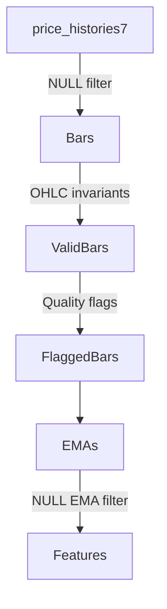

<objective>
Answer RVWQ-02 (How does incremental refresh work?) and RVWQ-03 (What validation happens where?)

Purpose: Document incremental refresh mechanics and map all validation points in the pipeline
Output: incremental-refresh.md and validation-points.md
</objective>

<execution_context>
@./.claude/get-shit-done/workflows/execute-plan.md
@./.claude/get-shit-done/templates/summary.md
</execution_context>

<context>
@.planning/PROJECT.md
@.planning/ROADMAP.md
@.planning/STATE.md

# Phase 20 outputs
@.planning/phases/20-historical-context/20-CURRENT-STATE.md
@.planning/phases/20-historical-context/20-HISTORICAL-REVIEW.md

# Phase 21 context
@.planning/phases/21-comprehensive-review/21-CONTEXT.md
@.planning/phases/21-comprehensive-review/21-RESEARCH.md

# State management modules
@src/ta_lab2/scripts/emas/ema_state_manager.py
@src/ta_lab2/scripts/emas/state_management.py
@src/ta_lab2/scripts/bars/common_snapshot_contract.py

# Bar builders (for state and validation patterns)
@src/ta_lab2/scripts/bars/refresh_cmc_price_bars_1d.py
@src/ta_lab2/scripts/bars/refresh_cmc_price_bars_multi_tf.py
@src/ta_lab2/scripts/bars/refresh_cmc_price_bars_multi_tf_cal_us.py

# EMA refreshers (for state patterns)
@src/ta_lab2/scripts/emas/refresh_cmc_ema_multi_tf_from_bars.py
@src/ta_lab2/scripts/emas/base_ema_refresher.py
</context>

<tasks>

<task type="auto">
  <name>Task 1: Answer RVWQ-02 - How does incremental refresh work?</name>
  <files>.planning/phases/21-comprehensive-review/findings/incremental-refresh.md</files>
  <action>
Document incremental refresh mechanics across bar builders and EMA refreshers:

**State Table Watermarking:**

1. **Bar Builder State Tables:**
   Read common_snapshot_contract.py and bar builder scripts to document:
   - 1D state table: cmc_price_bars_1d_state
     - Schema: id, last_src_ts, ... (cite line numbers)
     - How watermark is used: Query price_histories7 WHERE ts > last_src_ts
     - Update logic: After successful insert, update last_src_ts
   - Multi-TF state tables: cmc_price_bars_multi_tf_state, cal_* variants
     - Schema: id, tf, daily_min_seen, daily_max_seen, last_time_close, ...
     - How watermark differs: Tracks daily range for backfill detection
   - Calendar state tables: Additional tz column

2. **EMA State Tables:**
   Read ema_state_manager.py and EMA refresh scripts:
   - State table: cmc_ema_{variant}_state
   - Schema: id, tf, period, last_ts, row_count, updated_at
   - EMAStateManager class: load_state(), save_state(), get_dirty_windows()
   - How watermark works: Query bars WHERE ts > state.last_ts

**Picking Up Where Left Off:**
Document the exact flow:
1. Script starts
2. Load state from state table (cite load_state or equivalent)
3. Determine what needs processing (watermark comparison)
4. Query source only for new data (WHERE ts > watermark)
5. Process new data
6. Update state table with new watermark
7. Commit transaction

**Gap Handling:**
Document how gaps are handled:
- Missing days detection (is_missing_days flag)
- What happens if source has gap? (flag set, processing continues)
- What happens if state has gap? (backfill detection in multi-TF)
- dirty_windows concept in EMAStateManager

**Backfill Detection:**
Document how scripts detect when historical data was backfilled:
- daily_min_seen tracking in multi-TF builders
- If daily_min_seen moves earlier, trigger rebuild
- EMAStateManager get_dirty_windows()

**Output Format:**
```markdown
# Incremental Refresh: How It Works

## Executive Summary
[1 paragraph overview of watermark-based incremental refresh]

## Bar Builder Incremental Refresh

### State Table Schemas

#### 1D Bars (cmc_price_bars_1d_state)
| Column | Type | Purpose |
|--------|------|---------|
| id | int | Asset ID |
| last_src_ts | timestamp | Last processed source timestamp |
...

(Cite: common_snapshot_contract.py line N, refresh_cmc_price_bars_1d.py line N)

#### Multi-TF Bars (cmc_price_bars_multi_tf_state)
[Similar schema table with backfill detection columns]

### Refresh Flow
1. Load state (line N: `state = load_state(id)`)
2. Determine cutoff (line N: `cutoff = state.last_src_ts - lookback_days`)
3. Query source (line N: `SELECT ... WHERE ts >= cutoff`)
4. Process data (lines N-M)
5. Update state (line N: `upsert_state(id, new_last_ts)`)

### Gap Handling
[How is_missing_days is computed and flagged]

### Backfill Detection
[How daily_min_seen triggers rebuild]

## EMA Incremental Refresh

### State Table Schema (EMAStateManager)
[Schema table with explanation]

### EMAStateManager API
- load_state(id, tf, period): Returns last_ts, row_count
- save_state(id, tf, period, last_ts, row_count): Upserts state
- get_dirty_windows(): Returns (id, tf, period) tuples needing recompute

### Refresh Flow
[Step-by-step with line numbers]

### Dirty Window Handling
[How dirty_windows work for backfill]

## Key Differences: Bars vs EMAs
| Aspect | Bar Builders | EMA Refreshers |
|--------|--------------|----------------|
| State granularity | (id) or (id, tf) | (id, tf, period) |
| Watermark column | last_src_ts | last_ts |
| Backfill detection | daily_min_seen | get_dirty_windows() |
```
  </action>
  <verify>
- File exists at .planning/phases/21-comprehensive-review/findings/incremental-refresh.md
- Documents state table schemas for bar builders and EMAs
- Explains watermark-based refresh flow with line numbers
- Documents gap handling and backfill detection
- Covers both bar builders and EMA refreshers
  </verify>
  <done>
RVWQ-02 answered: Incremental refresh documented with state table watermarking, pickup-where-left-off flow, gap handling, and backfill detection for both bars and EMAs
  </done>
</task>

<task type="auto">
  <name>Task 2: Answer RVWQ-03 - What validation happens where?</name>
  <files>.planning/phases/21-comprehensive-review/findings/validation-points.md</files>
  <action>
Map all validation points in the bar/EMA pipeline:

**NULL Rejection:**
Search for NULL handling in scripts:
- WHERE clauses excluding NULLs (grep for "IS NOT NULL", "WHERE .* NOT NULL")
- NOT NULL constraints in CREATE TABLE or schema definitions
- Explicit NULL checks in Python code (if row is None, if pd.isna())
- Document: What columns? Where checked? What happens if NULL found?

**OHLC Invariants:**
Search for OHLC validation:
- high >= low checks
- high >= max(open, close)
- low <= min(open, close)
- time_high, time_low within [time_open, time_close]
- Document: What checks exist? Where applied? What happens on violation?

**Quality Flags:**
Document quality flag logic:
- is_partial_start: When is this TRUE? (line N shows condition)
- is_partial_end: When is this TRUE? (line N shows condition)
- is_missing_days: When is this TRUE? (line N shows condition)
- How are flags used downstream? (filtering, alerting, etc.)

**Data Quality Validation:**
Search for additional validation:
- Outlier detection (Z-score, percentile bounds)
- Rowcount validation
- Consistency checks (duplicate detection)
- Gap detection (missing days in sequence)

**Validation Point Catalog:**
Create comprehensive table:

| Validation | Type | Location | Script | Line | Action on Failure |
|------------|------|----------|--------|------|-------------------|
| OHLCV NOT NULL | NULL rejection | Before insert | refresh_cmc_price_bars_1d.py | 440 | Row rejected |
| high >= low | OHLC invariant | Before insert | refresh_cmc_price_bars_1d.py | 445 | Row rejected |
| is_partial_end | Quality flag | During compute | refresh_cmc_price_bars_multi_tf.py | 400 | Flag set |
| EMA source NOT NULL | NULL rejection | Data loading | base_ema_refresher.py | N | Row skipped |
...

**Validation Flow Diagram:**
Create Mermaid diagram showing validation checkpoints in the pipeline:


**Output Format:**
```markdown
# Validation Points: What Happens Where

## Executive Summary
[Overview of validation strategy: NULL rejection, invariants, quality flags]

## NULL Rejection Points

### Bar Builders
| Column | Validation | Script | Line | Action |
|--------|------------|--------|------|--------|
| open | NOT NULL | refresh_cmc_price_bars_1d.py | N | Reject row |
...

### EMA Refreshers
[Similar table]

## OHLC Invariant Checks

### Invariants Enforced
- high >= low (line N in script X)
- high >= max(open, close) (line N)
- low <= min(open, close) (line N)
- time_high in [time_open, time_close] (line N)

### Where Enforced
[Table mapping invariant to script and line]

### Failure Handling
[What happens when invariant violated - rejected to rejects table, etc.]

## Quality Flags

### Flag Definitions
| Flag | Meaning | Set When | Script | Line |
|------|---------|----------|--------|------|
| is_partial_start | Bar starts mid-period | First bar for asset | ... | ... |
| is_partial_end | Bar incomplete | day_date < bar_end | ... | ... |
| is_missing_days | Days missing in bar | count_missing_days > 0 | ... | ... |

### Flag Usage Downstream
[How features/signals use these flags]

## Additional Validation

### Outlier Detection
[If exists, document]

### Rowcount Validation
[If exists, document]

### Gap Detection
[How missing days are detected and flagged]

## Validation Flow
[Mermaid diagram showing validation checkpoints]

## Coverage Analysis
| Area | Validation Coverage | Gaps |
|------|---------------------|------|
| Bar OHLCV | NOT NULL + invariants | None |
| Bar dates | Gap detection | Quality flag only, no rejection |
| EMA inputs | NULL filter | None |
| EMA outputs | None | No output validation |
```
  </action>
  <verify>
- File exists at .planning/phases/21-comprehensive-review/findings/validation-points.md
- Documents NULL rejection points with line numbers
- Documents OHLC invariant checks with line numbers
- Documents quality flag logic with conditions and line numbers
- Contains validation flow diagram
- Coverage analysis identifies any gaps in validation
  </verify>
  <done>
RVWQ-03 answered: All validation points mapped with NULL rejection, OHLC invariants, quality flags documented with line numbers, validation flow diagram, and coverage analysis
  </done>
</task>

</tasks>

<verification>
After both tasks complete:
1. incremental-refresh.md answers RVWQ-02 comprehensively
2. validation-points.md answers RVWQ-03 comprehensively
3. Both documents have extensive line number citations
4. State table schemas documented
5. Validation coverage analysis identifies any gaps
</verification>

<success_criteria>
- RVWQ-02 answered: Incremental refresh explained (watermarking, pickup, gaps)
- RVWQ-03 answered: All validation points mapped (NULLs, OHLC, quality flags)
- Evidence standard met: Line numbers cited throughout
- Coverage analysis: Any validation gaps identified for Phase 22+
</success_criteria>

<output>
After completion, create `.planning/phases/21-comprehensive-review/21-03-SUMMARY.md`
</output>
