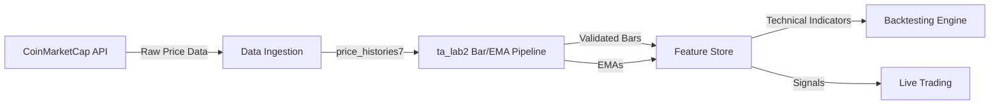
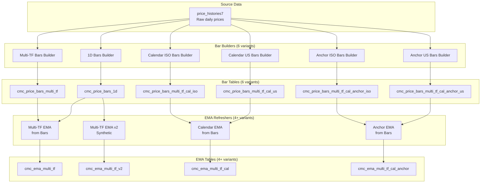
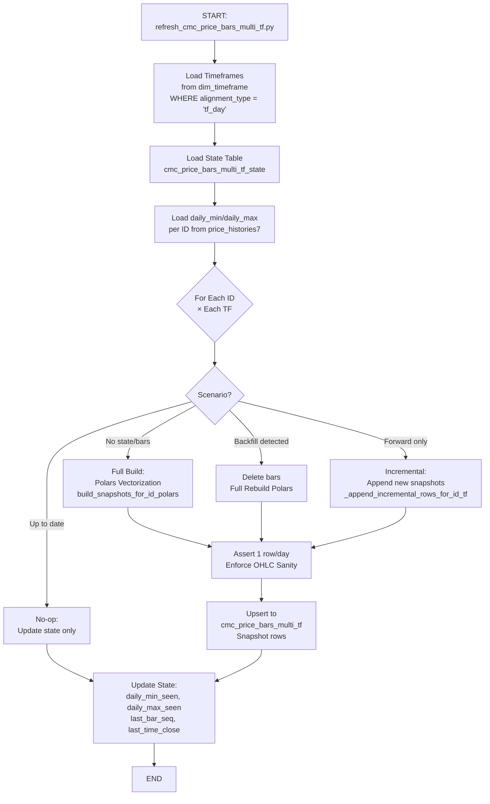
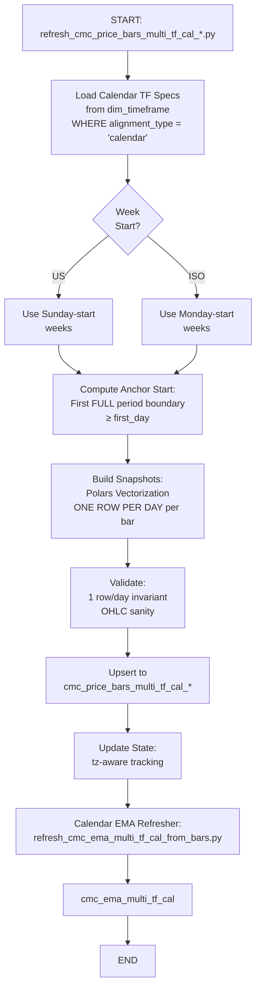

# Data Flow Diagram: Bars and EMAs

**Phase:** 21 Comprehensive Review
**Deliverable:** RVWD-02
**Generated:** 2026-02-05
**Purpose:** Visual + narrative documentation of complete data pipeline from price_histories7 → bars → EMAs

---

## Table of Contents

1. [L0: Context Diagram](#l0-context-diagram)
2. [L1: System Overview](#l1-system-overview)
3. [L2: Detailed Process Flows](#l2-detailed-process-flows)
4. [Validation Points Summary](#validation-points-summary)
5. [State Management Flows](#state-management-flows)

---

## L0: Context Diagram

### Visual Overview



### Narrative

**System Boundary:** ta_lab2 Bar/EMA Pipeline

**External Entities:**
- **CoinMarketCap API:** Source of raw cryptocurrency price data (OHLC, volume, market cap)
- **Data Ingestion:** Loads raw data into `price_histories7` table (outside this system's scope)
- **Feature Store:** Consumes validated bars and EMAs for downstream analysis
- **Backtesting Engine:** Uses technical indicators for strategy testing
- **Live Trading:** Consumes real-time signals for trade execution

**System Purpose:**
Transform raw price history into:
1. **Validated Bars:** Aggregated OHLCV data at multiple timeframes with quality checks
2. **EMAs:** Exponential Moving Averages computed from validated bars at various periods

**Data Quality Guarantee:**
All data leaving this system has passed validation (OHLC invariants, timestamp consistency, NULL checks).

---

## L1: System Overview

### Visual Overview



### Narrative

**System Components:**

**1. Source Data Layer:**
- `price_histories7`: Raw daily price data from CoinMarketCap API
  - Columns: `id`, `timestamp`, `open`, `high`, `low`, `close`, `volume`, `market_cap`, `timehigh`, `timelow`
  - Granularity: One row per asset per day (UTC)

**2. Bar Builder Layer (6 variants):**

| Variant | Purpose | Output Granularity | Calendar Semantics |
|---------|---------|-------------------|-------------------|
| 1D | Canonical daily bars | One bar per day | None (data-aligned) |
| Multi-TF | Row-count multi-timeframe | Multiple snapshots per bar | tf_day style, data-start anchor |
| Cal US | Calendar-aligned | Daily snapshots, full periods only | US Sunday-start weeks |
| Cal ISO | Calendar-aligned | Daily snapshots, full periods only | ISO Monday-start weeks |
| Anchor US | Calendar-anchored | Daily snapshots, partial allowed | US Sunday-start, year-anchored |
| Anchor ISO | Calendar-anchored | Daily snapshots, partial allowed | ISO Monday-start, year-anchored |

**3. EMA Refresher Layer (4+ variants):**

| Variant | Source Bars | Purpose | Timeframe Source |
|---------|-------------|---------|------------------|
| Multi-TF from Bars | cmc_price_bars_multi_tf (+ 1D for 1D TF) | EMAs from persisted multi-TF bars | dim_timeframe (tf_day, canonical) |
| Multi-TF v2 | cmc_price_bars_1d | Synthetic multi-TF EMAs from daily | dim_timeframe (tf_day, canonical) |
| Calendar from Bars | cmc_price_bars_multi_tf_cal_us/iso | EMAs from calendar bars | dim_timeframe (calendar, full-period) |
| Anchor from Bars | cmc_price_bars_multi_tf_cal_anchor_us/iso | EMAs from anchored bars | dim_timeframe (calendar_anchor) |

**4. Output Tables:**
- 6 bar tables: Validated, aggregated bars at various timeframes/calendar semantics
- 4+ EMA tables: Exponential Moving Averages at various periods (9, 10, 21, 50, 100, 200, etc.)

**Key Design Decisions:**

1. **Separation of Concerns:** Bars and EMAs are separate pipelines (modular, not tightly coupled)
2. **Multiple Bar Variants Justified:** Different calendar semantics for different use cases
   - Multi-TF: Trading strategies using row-count bars
   - Calendar: Monthly/quarterly analysis aligned to calendar periods
   - Anchor: Year-over-year comparisons with consistent anchoring
3. **EMA Variants Follow Bar Variants:** Each bar style has matching EMA computation
4. **State-Based Incremental Refresh:** All scripts track state for efficient updates

---

## L2: Detailed Process Flows

### Flow 1: price_histories7 → 1D Bars

#### Visual

```mermaid
graph TB
    Start[START:<br/>refresh_cmc_price_bars_1d.py] --> LoadState[Load State Table<br/>cmc_price_bars_1d_state]
    LoadState --> CheckState{State<br/>exists?}

    CheckState -->|No| FullBuild[Full Build:<br/>Process ALL history]
    CheckState -->|Yes| GetLastTS[Get last_src_ts<br/>per ID]

    GetLastTS --> ComputeWindow[Compute Window:<br/>last_src_ts - lookback_days]
    ComputeWindow --> QuerySource[Query price_histories7<br/>WHERE ts > window_start]

    FullBuild --> QueryFull[Query price_histories7<br/>ALL rows for ID]
    QueryFull --> ProcessBars
    QuerySource --> ProcessBars[Process Bars:<br/>1. Assign tf=1D, bar_seq<br/>2. Compute OHLCV<br/>3. Repair time_high/time_low]

    ProcessBars --> Validate{Validate<br/>OHLC invariants?}

    Validate -->|PASS| Upsert[Upsert to<br/>cmc_price_bars_1d<br/>ON CONFLICT DO UPDATE]
    Validate -->|FAIL| Reject[Insert to<br/>cmc_price_bars_1d_rejects<br/>with reason]

    Upsert --> UpdateState[Update State:<br/>last_src_ts = max(timestamp)<br/>last_run_ts = now()]
    Reject --> UpdateState

    UpdateState --> End[END]
```

#### Narrative

**Script:** `refresh_cmc_price_bars_1d.py`
**Entry Point:** `main()` at line 780
**Mode:** Incremental (default) or Full Rebuild (`--rebuild` flag)

**Step 1: Load State**
- Query `cmc_price_bars_1d_state` table (line 792) for `last_src_ts` per ID (line 244)
- If no state exists → Full build from beginning
- If state exists → Incremental build from `last_src_ts - lookback_days` (default: 3 days)

**Step 2: Query Source Data**
```sql
SELECT * FROM price_histories7
WHERE id = ?
  AND timestamp > (last_src_ts - 3 days)
  AND timestamp < time_max  -- optional bound
```
(Query pattern at lines 283-315)

**Step 3: Process Bars**
- Assign `tf = '1D'` (line 390)
- Compute `bar_seq` via `dense_rank()` ordered by timestamp (line 282)
- Calculate OHLCV:
  - `open` = first row's open
  - `high/low` = max/min across rows
  - `close` = last row's close
  - `volume` = sum of volume
  - `market_cap` = last row's market_cap

**Step 4: Repair time_high/time_low** (lines 334-365)
- If `time_high` NULL or outside `[time_open, time_close]`:
  - Bullish (close >= open) → repair to `time_close`
  - Bearish (close < open) → repair to `time_open`
- Similar logic for `time_low`
- Set `repaired_timehigh/repaired_timelow` flags

**Step 5: Validate OHLC Invariants** (lines 440-459)
```sql
WHERE id IS NOT NULL
  AND timestamp IS NOT NULL
  AND open IS NOT NULL
  AND close IS NOT NULL
  AND volume IS NOT NULL
  AND market_cap IS NOT NULL
  AND time_high_fix IS NOT NULL
  AND time_low_fix IS NOT NULL
  AND high_fix IS NOT NULL
  AND low_fix IS NOT NULL
  AND time_open <= time_close
  AND time_open <= time_high_fix AND time_high_fix <= time_close
  AND time_open <= time_low_fix AND time_low_fix <= time_close
  AND high_fix >= low_fix
  AND high_fix >= GREATEST(open, close, low_fix)
  AND low_fix <= LEAST(open, close, high_fix)
```

**Validation Points:**
1. NOT NULL checks on all critical fields
2. Timestamp ordering: `time_open <= time_close`
3. Extrema within bar window
4. OHLC relationships: `high >= low`, `high >= max(open, close)`, `low <= min(open, close)`

**Step 6: Upsert or Reject**
- **Pass validation** → Upsert to `cmc_price_bars_1d` with `ON CONFLICT (id, timestamp) DO UPDATE` (lines 460-481)
- **Fail validation** → Insert to `cmc_price_bars_1d_rejects` with categorized reason (lines 589-604):
  - `null_pk`, `null_ohlc`, `time_open_gt_time_close`, `high_lt_low`, etc.

**Step 7: Update State** (lines 741-756)
```sql
INSERT INTO cmc_price_bars_1d_state (id, last_src_ts, last_run_ts, last_upserted, ...)
VALUES (?, ?, now(), ?, ...)
ON CONFLICT (id) DO UPDATE SET
  last_src_ts = COALESCE(EXCLUDED.last_src_ts, cmc_price_bars_1d_state.last_src_ts),
  last_run_ts = now(),
  ...
```

**Quality Flags** (lines 140-143):
- `is_partial_start = FALSE` (1D bars are always complete)
- `is_partial_end = FALSE`
- `is_missing_days = FALSE`

**Output:**
- Rows upserted to `cmc_price_bars_1d`
- State updated per ID
- Rejects logged (if `--keep-rejects` flag)

---

### Flow 2: price_histories7 → Multi-TF Bars

#### Visual



#### Narrative

**Script:** `refresh_cmc_price_bars_multi_tf.py`
**Entry Point:** `main()` at line 1398
**Mode:** Incremental (default) with backfill detection, optional parallel (`--num-processes`)

**Step 1: Load Timeframes from dim_timeframe** (lines 105-148)
```sql
SELECT tf, tf_days_nominal, sort_order, is_canonical
FROM public.dim_timeframe
WHERE alignment_type = 'tf_day'
  AND roll_policy = 'multiple_of_tf'
  AND calendar_scheme IS NULL
  AND tf_qty >= 2
  AND tf_days_nominal IS NOT NULL
  AND is_intraday = FALSE
ORDER BY sort_order, tf;
```
- Example TFs: `2D`, `7D`, `14D`, `28D`, `91D`, `365D`
- Filter to `is_canonical = TRUE` unless `--include-non-canonical`

**Step 2: Load State and Daily Min/Max** (lines 761-774)
- Load `cmc_price_bars_multi_tf_state` for all (id, tf) combinations
- Query `price_histories7` for `MIN(timestamp)` and `MAX(timestamp)` per ID

**Step 3: Determine Scenario per (ID, TF)** (lines 788-970)

**Scenario A: No State + No Bars** (lines 794-821)
- Load ALL daily prices for ID from `price_histories7`
- Call `build_snapshots_for_id_polars()` at line 798 (FAST PATH)
  - Uses Polars for 20-30% speedup vs pandas
  - Vectorized operations: `cum_max`, `cum_min`, `cum_sum` for OHLCV aggregation
  - Emits ONE ROW PER DAY per bar_seq (append-only snapshot model)
- Upsert bars to table
- Create initial state

**Scenario B: Backfill Detected** (lines 863-895)
```python
if daily_min_ts < daily_min_seen:
    # Data added BEFORE previously processed range
    delete_bars_for_id_tf(db_url, bars_table, id_, tf)
    # Full rebuild with Polars
    bars = build_snapshots_for_id_polars(df_full, tf_days, tf_label)
    upsert_bars(bars)
```

**Scenario C: Forward Incremental** (lines 911-970)
- New data exists AFTER `last_time_close`
- Call `_append_incremental_rows_for_id_tf()` at line 912
  - Load last snapshot row from bars table
  - For each new daily close:
    - Continue current bar if `pos_in_bar < tf_days`
    - Start new bar if prior bar complete
    - Use carry-forward optimization if strict gate passes (lines 589-630):
      - Yesterday's snapshot + today's daily close = new snapshot (O(1) update)
      - Gate: last_day + 1 = today, same bar_seq, no missing days
    - Fallback: recompute from bar_start (explicit math)
- Upsert new snapshot rows

**Scenario D: Up to Date** (lines 897-909)
- `daily_max_ts <= last_time_close` → nothing new
- Update state with expanded range, no bar changes

**Step 4: Validate Bars** (lines 196, 312)
- **Invariant:** `assert_one_row_per_local_day()` at line 196 (from contract module)
  - Enforces exactly 1 row per calendar day in source data
- **Sanity:** `enforce_ohlc_sanity()` at line 312
  - Clamps OHLC to satisfy invariants after aggregation

**Step 5: Upsert Bars** (via contract module utility)
- Append-only upsert to `cmc_price_bars_multi_tf`
- Primary key expected: `(id, tf, bar_seq, time_close)` for snapshots

**Step 6: Update State** (line 972)
```python
upsert_state(db_url, state_table, state_updates, with_tz=False)
# state_updates contains:
# - id, tf
# - daily_min_seen = min(daily_min_seen, daily_min_ts)
# - daily_max_seen = max(daily_max_seen, daily_max_ts)
# - last_bar_seq = bars["bar_seq"].max()
# - last_time_close = bars["time_close"].max()
```

**Quality Flags:**
- `is_partial_start = FALSE` (data-start anchoring, first bar always full from data perspective)
- `is_partial_end = TRUE` if `pos_in_bar < tf_days` (bar still forming)
- `is_missing_days = TRUE` if expected days != available days in `[bar_start, snapshot_day]`

**Output:**
- Snapshot rows in `cmc_price_bars_multi_tf` (one row per day per bar)
- State updated per (id, tf)

---

### Flow 3: Multi-TF Bars → EMAs (v1)

#### Visual

```mermaid
graph TB
    Start[START:<br/>refresh_cmc_ema_multi_tf_from_bars.py] --> LoadTFs[Load Timeframes<br/>from dim_timeframe<br/>WHERE alignment_type = 'tf_day']

    LoadTFs --> LoadState[Load State Table<br/>cmc_ema_multi_tf_state<br/>per (id, tf, period)]

    LoadState --> CheckMode{Mode?}

    CheckMode -->|Full Refresh| FullRefresh[Full Refresh:<br/>Ignore state<br/>Recompute ALL EMAs]
    CheckMode -->|Incremental| LoadBars[Load bars FROM<br/>last_time_close]

    FullRefresh --> SelectBarsTable
    LoadBars --> SelectBarsTable{Select<br/>Bars Table}

    SelectBarsTable -->|TF = 1D| UseBars1D[Use cmc_price_bars_1d<br/>Validated bars]
    SelectBarsTable -->|TF != 1D| UseBarsMulti[Use cmc_price_bars_multi_tf<br/>Snapshot bars]

    UseBars1D --> ComputeEMA
    UseBarsMulti --> ComputeEMA[Compute EMAs:<br/>write_multi_timeframe_ema_to_db<br/>for periods 6,9,10,12,14,17,20,21,26,30,50,52,77,100,200,252,365]

    ComputeEMA --> UpsertEMA[Upsert to<br/>cmc_ema_multi_tf]

    UpsertEMA --> UpdateState3[Update State:<br/>daily_min_seen, daily_max_seen<br/>last_time_close, last_canonical_ts<br/>per (id, tf, period)]

    UpdateState3 --> End[END]
```

#### Narrative

**Script:** `refresh_cmc_ema_multi_tf_from_bars.py`
**Entry Point:** Inferred `main()` around line 250+
**Mode:** Incremental (default) via `BaseEMARefresher` template, Full Refresh with `--full-refresh`

**Step 1: Load Timeframes** (lines 76-82)
```python
tfs = list_tfs(
    db_url=db_url,
    alignment_type="tf_day",
    canonical_only=True,
)
# Returns: ["1D", "2D", "7D", "14D", "28D", "91D", "365D"]
```

**Step 2: Load State** (via `EMAStateManager`)
- Query `cmc_ema_multi_tf_state` for existing state per (id, tf, period)
- Unified state schema:
  ```sql
  PRIMARY KEY (id, tf, period)
  Columns: daily_min_seen, daily_max_seen, last_bar_seq, last_time_close, last_canonical_ts, updated_at
  ```

**Step 3: Determine Incremental vs Full**
- **Full Refresh:** `--full-refresh` flag → ignore state, recompute from beginning
- **Incremental:** Use `last_time_close` as start timestamp for bar queries

**Step 4: Select Bars Table** (lines 87-91)
```python
# Special handling for 1D timeframe
actual_bars_table = "cmc_price_bars_1d" if tf == "1D" else "cmc_price_bars_multi_tf"
```
**Rationale:**
- `cmc_price_bars_1d` has better validation (canonical bars)
- `cmc_price_bars_multi_tf` is snapshot-based (multiple rows per bar)
- For 1D EMA: use canonical 1D bars (one row per day per asset)
- For 2D+ EMAs: use multi-TF snapshots (filter to `is_partial_end = FALSE` for canonical bars)

**Step 5: Compute EMAs** (lines 93-104)
```python
n = write_multi_timeframe_ema_to_db(
    ids=[id_],
    start=start,  # last_time_close or "2010-01-01"
    end=end,
    ema_periods=[6, 9, 10, 12, 14, 17, 20, 21, 26, 30, 50, 52, 77, 100, 200, 252, 365],
    tf_subset=[tf],
    db_url=db_url,
    schema="public",
    out_table="cmc_ema_multi_tf",
    bars_schema="public",
    bars_table_tf_day=actual_bars_table,
)
```
**Delegation:** Calls feature module `ema_multi_timeframe.py` for actual EMA calculation
**Output:** Returns number of rows inserted/updated

**Step 6: Upsert EMAs**
- Feature module handles upsert to `cmc_ema_multi_tf`
- Expected schema: `id`, `ts`, `tf`, `period`, `ema`, `roll`, etc.

**Step 7: Update State** (delegated to `BaseEMARefresher`)
```python
# EMAStateManager.update_state_from_output()
# Queries output table for latest timestamps per (id, tf, period)
# Updates state table with:
# - daily_min_seen, daily_max_seen (from bars metadata)
# - last_time_close, last_canonical_ts (from EMA output)
# - updated_at = now()
```

**Worker Function** (lines 42-114):
- Module-level for multiprocessing (pickling requirement)
- Creates NullPool engine per worker (avoid connection pool issues)
- Processes ALL TFs for given ID sequentially
- Returns aggregated row count

**Logging:**
- Worker-level logger: `get_worker_logger()` at lines 56-61
- Logs start/complete/errors per ID

**Output:**
- EMA rows in `cmc_ema_multi_tf` per (id, ts, tf, period)
- State updated per (id, tf, period)

---

### Flow 4: Calendar Variants (cal_us, cal_iso, cal_anchor_us, cal_anchor_iso)

#### Visual (Simplified - Same Pattern for All)



#### Narrative

**Calendar Bars Key Differences:**

**1. Calendar Alignment:**
- **US (cal_us, cal_anchor_us):** Sunday-start weeks (US convention)
- **ISO (cal_iso, cal_anchor_iso):** Monday-start weeks (ISO 8601)

**2. Partial Bar Policy:**
- **Full Period (cal_us, cal_iso):** `allow_partial_start = FALSE`, `allow_partial_end = FALSE`
  - First bar starts at first FULL calendar boundary ≥ first_day
  - Example: If data starts Tuesday, first weekly bar starts following Sunday/Monday
- **Anchored (cal_anchor_us, cal_anchor_iso):** `allow_partial_start = TRUE`, `allow_partial_end = TRUE`
  - First bar starts at anchor window containing first_day (may be partial)
  - Enables year-over-year comparisons with consistent anchoring

**3. Bar Boundaries:**
- **Weeks:** Fixed N×7 days (e.g., 1W = 7 days, 4W = 28 days)
- **Months:** Variable days (28-31 depending on month)
- **Years:** Variable days (365-366 depending on leap year)

**4. Timeframe Source:**
- Query `dim_timeframe` with:
  ```sql
  WHERE alignment_type = 'calendar'
    AND base_unit IN ('W', 'M', 'Y')
    AND (specific filters for US vs ISO, full-period vs anchor)
  ```

**5. Snapshot Model:**
- Same as multi_tf: ONE ROW PER DAY per bar_seq
- `is_partial_end = TRUE` until bar reaches scheduled end day
- `is_partial_end = FALSE` on canonical bar-close day

**6. Missing Days Handling:**
- Compute expected days in `[bar_start, snapshot_day]`
- Detect missing days (weekends, holidays, data gaps)
- Breakdown: start-run, interior, end-run missing days

**Calendar EMA Pipeline:**
- Calendar bars → `refresh_cmc_ema_multi_tf_cal_from_bars.py`
- Reads calendar bar tables (cal_us or cal_iso)
- Computes EMAs aligned to calendar periods
- Output: `cmc_ema_multi_tf_cal`

**Example Flow (4W_CAL_US):**
1. Data starts: 2020-01-15 (Wednesday)
2. First Sunday ≥ 2020-01-15: 2020-01-19
3. First 4W bar: 2020-01-19 to 2020-02-15 (28 days)
4. Emit daily snapshots: 2020-01-19, 2020-01-20, ..., 2020-02-15
5. Only 2020-02-15 snapshot has `is_partial_end = FALSE` (canonical)

---

## Validation Points Summary

### Bar Builder Validation Points

| Point | Location | Check | Script | Line(s) |
|-------|----------|-------|--------|---------|
| One row per local day | Before bar calculation | Unique (id, day_date) | All bar builders | Via `assert_one_row_per_local_day()` |
| NOT NULL - OHLC | Before upsert | open, high, low, close IS NOT NULL | refresh_cmc_price_bars_1d.py | 446-448 |
| NOT NULL - timestamps | Before upsert | time_open, time_close, time_high, time_low IS NOT NULL | refresh_cmc_price_bars_1d.py | 444-445, 450-451 |
| NOT NULL - metadata | Before upsert | volume, market_cap IS NOT NULL | refresh_cmc_price_bars_1d.py | 448-449 |
| Timestamp ordering | Before upsert | time_open <= time_close | refresh_cmc_price_bars_1d.py | 454 |
| Extrema within window | Before upsert | time_open <= time_high/time_low <= time_close | refresh_cmc_price_bars_1d.py | 455-456 |
| OHLC invariant (high/low) | Before upsert | high >= low | refresh_cmc_price_bars_1d.py | 457 |
| OHLC invariant (high bound) | Before upsert | high >= GREATEST(open, close, low) | refresh_cmc_price_bars_1d.py | 458 |
| OHLC invariant (low bound) | Before upsert | low <= LEAST(open, close, high) | refresh_cmc_price_bars_1d.py | 459 |
| Time high/low repair | During bar calculation | Repair NULL or out-of-window extrema times | refresh_cmc_price_bars_1d.py | 334-365 |
| OHLC sanity enforcement | After aggregation | Clamp OHLC to satisfy invariants | refresh_cmc_price_bars_multi_tf.py | 312 (via `enforce_ohlc_sanity()`) |
| Contract schema normalization | After bar building | Ensure all required columns exist with defaults | All bar builders (multi_tf+) | Via `normalize_output_schema()` |

### EMA Refresher Validation Points

| Point | Location | Check | Script | Mechanism |
|-------|----------|-------|--------|-----------|
| Bar table existence | Before EMA computation | Bars table accessible | All EMA refreshers | Via feature module queries |
| State consistency | Before incremental | Check for backfill via daily_min_seen | All EMA refreshers | `if daily_min_ts < daily_min_seen → rebuild` |
| Canonical bar filter | During bar loading | Filter to is_partial_end = FALSE | Multi-TF EMA refreshers | Feature module query: `WHERE roll = FALSE` |
| EMA period validity | Before computation | Periods > 0 | All EMA refreshers | CLI validation in BaseEMARefresher |
| State update after success | After EMA computation | Update state only if computation succeeds | All EMA refreshers | EMAStateManager transaction |

### Reject Reasons (1D Builder)

| Reason Code | Meaning | Example | Line |
|-------------|---------|---------|------|
| null_pk | id or timestamp is NULL | Missing asset ID | 590 |
| null_tf_or_bar_seq | tf or bar_seq is NULL | Failed bar assignment | 591 |
| null_time_open_time_close | time_open or time_close is NULL | Missing bar boundary | 592 |
| null_open_close | open or close is NULL | Missing OHLC data | 593 |
| null_volume | volume is NULL | Missing volume data | 594 |
| null_market_cap | market_cap is NULL | Missing market cap | 595 |
| time_open_gt_time_close | time_open > time_close | Invalid bar window | 596 |
| null_time_high_time_low_after_repair | time_high/time_low NULL post-repair | Repair failed | 597 |
| time_high_outside_window_after_repair | time_high not in [time_open, time_close] | Repair failed | 598 |
| time_low_outside_window_after_repair | time_low not in [time_open, time_close] | Repair failed | 599 |
| null_ohlc_after_repair | OHLC NULL post-repair | Aggregation failed | 600 |
| high_lt_low_after_repair | high < low post-repair | OHLC invariant violated | 601 |
| high_lt_greatest(open,close,low)_after_repair | high < max(open, close, low) | OHLC invariant violated | 602 |
| low_gt_least(open,close,high)_after_repair | low > min(open, close, high) | OHLC invariant violated | 603 |
| failed_final_filter_unknown | Unknown failure reason | Catch-all | 604 |

---

## State Management Flows

### Bar Builder State Pattern

```mermaid
graph TB
    Start[Query price_histories7<br/>for daily_min_ts, daily_max_ts] --> LoadState[Load State Table<br/>for (id, tf)]

    LoadState --> CompareMin{daily_min_ts<br/>< daily_min_seen?}

    CompareMin -->|Yes| Backfill[Backfill Detected:<br/>DELETE bars for (id, tf)<br/>Full rebuild]
    CompareMin -->|No| CompareMax{daily_max_ts<br/>> last_time_close?}

    Backfill --> BuildBars

    CompareMax -->|Yes| Incremental[Forward Incremental:<br/>Append new snapshots]
    CompareMax -->|No| NoOp2[No-op:<br/>Already up to date]

    Incremental --> BuildBars[Build/Append Bars]

    BuildBars --> UpdateStateBar[Update State:<br/>daily_min_seen = min(daily_min_seen, daily_min_ts)<br/>daily_max_seen = max(daily_max_seen, daily_max_ts)<br/>last_bar_seq = bars.bar_seq.max()<br/>last_time_close = bars.time_close.max()]

    NoOp2 --> UpdateStateBar

    UpdateStateBar --> End2[State Persisted]
```

### EMA Refresher State Pattern

```mermaid
graph TB
    Start[Load State from<br/>cmc_ema_*_state<br/>for (id, tf, period)] --> CheckFull{Full<br/>Refresh?}

    CheckFull -->|Yes| IgnoreState[Ignore State:<br/>start = '2010-01-01']
    CheckFull -->|No| UseState[Use State:<br/>start = last_time_close]

    IgnoreState --> QueryBars
    UseState --> QueryBars[Query Bars FROM start<br/>WHERE is_partial_end = FALSE]

    QueryBars --> ComputeEMAs[Compute EMAs<br/>via feature module]

    ComputeEMAs --> UpsertEMAs[Upsert to<br/>cmc_ema_* table]

    UpsertEMAs --> UpdateStateEMA[Update State:<br/>Query bars metadata for daily_min/max<br/>Query EMA output for last_time_close/last_canonical_ts<br/>Set updated_at = now()]

    UpdateStateEMA --> End3[State Persisted]
```

### State Schema Comparison

#### Bar Builder State (Example: multi_tf)
```sql
CREATE TABLE cmc_price_bars_multi_tf_state (
    id                INTEGER         NOT NULL,
    tf                TEXT            NOT NULL,
    daily_min_seen    TIMESTAMPTZ     NULL,
    daily_max_seen    TIMESTAMPTZ     NULL,
    last_bar_seq      INTEGER         NULL,
    last_time_close   TIMESTAMPTZ     NULL,
    updated_at        TIMESTAMPTZ     NOT NULL DEFAULT now(),
    PRIMARY KEY (id, tf)
);
```

#### EMA Refresher State (Unified Schema)
```sql
CREATE TABLE cmc_ema_*_state (
    id                  INTEGER         NOT NULL,
    tf                  TEXT            NOT NULL,
    period              INTEGER         NOT NULL,
    daily_min_seen      TIMESTAMPTZ     NULL,
    daily_max_seen      TIMESTAMPTZ     NULL,
    last_bar_seq        INTEGER         NULL,
    last_time_close     TIMESTAMPTZ     NULL,
    last_canonical_ts   TIMESTAMPTZ     NULL,
    updated_at          TIMESTAMPTZ     NOT NULL DEFAULT now(),
    PRIMARY KEY (id, tf, period)
);
```

**Key Difference:** EMA state adds `period` to PRIMARY KEY (one state row per EMA period)

---

## Cross-References to Script Inventory

All scripts referenced in this document are fully cataloged in [script-inventory.md](./script-inventory.md) with:
- Complete purpose descriptions
- Full table dependencies
- Line-by-line citations
- Validation logic details
- CLI argument specifications

**Integration Points:**
- Bar builders (6 scripts) → Bar tables (6 tables) → [Script Inventory: Bar Builders](#bar-builders)
- EMA refreshers (4 scripts) → EMA tables (4+ tables) → [Script Inventory: EMA Refreshers](#ema-refreshers)
- Supporting modules → [Script Inventory: Supporting Modules](#supporting-modules)

---

## Summary

**Complete Data Pipeline:**
1. **Ingestion:** CoinMarketCap API → price_histories7 (raw daily prices)
2. **Bar Building:** price_histories7 → 6 bar tables (1D, multi-TF, calendar variants)
3. **EMA Computation:** Bar tables → 4+ EMA tables (various timeframes and periods)
4. **Downstream:** EMAs → Feature Store → Backtesting/Live Trading

**Validation Strategy:**
- **Layer 1 (Bar Builders):** Enforce OHLC invariants, timestamp consistency, one-row-per-day
- **Layer 2 (EMA Refreshers):** Assume validated bars, focus on state consistency

**State Management:**
- **Bar builders:** Track daily_min_seen, daily_max_seen for backfill detection
- **EMA refreshers:** Track last_time_close per (id, tf, period) for incremental computation

**Performance:**
- Polars vectorization: 5-30% speedup for full rebuilds
- Multiprocessing: Per-ID parallelism with batch state loading
- Carry-forward optimization: O(1) snapshot updates when continuity gate passes

**Design Principles:**
- Modular: Bars and EMAs are separate pipelines
- Incremental: State-based refresh minimizes recomputation
- Validated: Multiple validation layers ensure data quality
- Flexible: 6 bar variants support different calendar semantics
