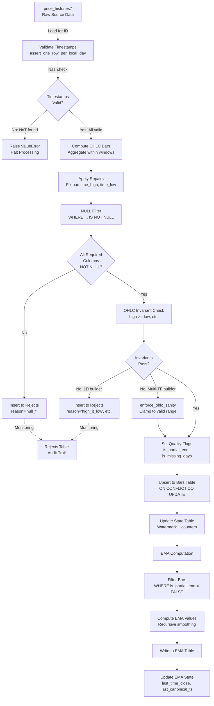

# Validation Points: What Happens Where

## Executive Summary

ta_lab2 enforces data quality through three validation layers: (1) NULL rejection via WHERE clause filtering before insert, (2) OHLC invariant enforcement via computed columns and clamp logic, and (3) quality flags (is_partial_start, is_partial_end, is_missing_days) to mark data completeness. Validation is defensive: invalid rows are rejected to a separate rejects table with documented failure reasons, while quality flags allow downstream systems to filter incomplete or gapped data without blocking the pipeline.

## NULL Rejection Points

### Bar Builders

#### 1D Bar Builder (refresh_cmc_price_bars_1d.py)

**Validation Location:** SQL INSERT statement WHERE clause (lines 440-453)

| Column | Validation | Script | Line | Action on Failure |
|--------|------------|--------|------|-------------------|
| id | IS NOT NULL | refresh_cmc_price_bars_1d.py | 440 | Row rejected to rejects table with reason='null_pk' |
| timestamp | IS NOT NULL | refresh_cmc_price_bars_1d.py | 441 | Row rejected to rejects table with reason='null_pk' |
| tf | IS NOT NULL | refresh_cmc_price_bars_1d.py | 442 | Row rejected to rejects table with reason='null_tf_or_bar_seq' |
| bar_seq | IS NOT NULL | refresh_cmc_price_bars_1d.py | 443 | Row rejected to rejects table with reason='null_tf_or_bar_seq' |
| time_open | IS NOT NULL | refresh_cmc_price_bars_1d.py | 444 | Row rejected to rejects table with reason='null_time_open_time_close' |
| time_close | IS NOT NULL | refresh_cmc_price_bars_1d.py | 445 | Row rejected to rejects table with reason='null_time_open_time_close' |
| open | IS NOT NULL | refresh_cmc_price_bars_1d.py | 446 | Row rejected to rejects table with reason='null_open_close' |
| close | IS NOT NULL | refresh_cmc_price_bars_1d.py | 447 | Row rejected to rejects table with reason='null_open_close' |
| volume | IS NOT NULL | refresh_cmc_price_bars_1d.py | 448 | Row rejected to rejects table with reason='null_volume' |
| market_cap | IS NOT NULL | refresh_cmc_price_bars_1d.py | 449 | Row rejected to rejects table with reason='null_market_cap' |
| time_high_fix | IS NOT NULL | refresh_cmc_price_bars_1d.py | 450 | Row rejected to rejects table with reason='null_time_high_time_low_after_repair' |
| time_low_fix | IS NOT NULL | refresh_cmc_price_bars_1d.py | 451 | Row rejected to rejects table with reason='null_time_high_time_low_after_repair' |
| high_fix | IS NOT NULL | refresh_cmc_price_bars_1d.py | 452 | Row rejected to rejects table with reason='null_ohlc_after_repair' |
| low_fix | IS NOT NULL | refresh_cmc_price_bars_1d.py | 453 | Row rejected to rejects table with reason='null_ohlc_after_repair' |

**Validation Context:**
- Occurs in `_insert_valid_and_return_stats_sql()` CTE pipeline
- Final WHERE clause filters rows before INSERT INTO destination table
- Failed rows captured by `_insert_rejects_sql()` (lines 492-662)
- Rejects table schema includes `reason` column documenting specific failure

**Reject Tracking:**
```sql
-- Line 644 onwards: INSERT INTO rejects table
INSERT INTO {rej} (
  id, "timestamp", tf, bar_seq, reason,
  time_open, time_close, time_high, time_low,
  open, high, low, close, volume, market_cap,
  ...
)
SELECT ... FROM rej_rows
```

**Failure Reasons Catalog** (lines 589-604):
- `null_pk`: id or timestamp NULL
- `null_tf_or_bar_seq`: tf or bar_seq NULL
- `null_time_open_time_close`: time_open or time_close NULL
- `null_open_close`: open or close NULL
- `null_volume`: volume NULL
- `null_market_cap`: market_cap NULL
- `null_time_high_time_low_after_repair`: time_high_fix or time_low_fix NULL after repair
- `null_ohlc_after_repair`: high_fix or low_fix NULL after repair

#### Multi-TF Bar Builder (refresh_cmc_price_bars_multi_tf.py)

**Validation Location:** Python code in `assert_one_row_per_local_day` (common_snapshot_contract.py lines 34-74)

| Column | Validation | Script | Line | Action on Failure |
|--------|------------|--------|------|-------------------|
| ts | NOT NULL (checked implicitly) | common_snapshot_contract.py | 51-54 | Raises ValueError with message "ts contains NaT/invalid timestamps" |

**Additional Validation:**
```python
# Line 51-54: NaT detection
ts = pd.to_datetime(df[ts_col], utc=True, errors="coerce")
if ts.isna().any():
    bad = df.loc[ts.isna()].head(5)
    raise ValueError(f"{ts_col} contains NaT/invalid timestamps. Sample:\n{bad}")
```

**Note:** Multi-TF builder does not reject rows to a rejects table. Instead, it raises exceptions that halt processing for that ID. NULL validation is less strict than 1D builder.

**Shared Validation (all bar builders):** `upsert_bars()` in common_snapshot_contract.py (lines 711-775)

Before upsert, normalize schema and enforce OHLC sanity:
```python
# Line 761-762
df2 = normalize_output_schema(df)
df2 = enforce_ohlc_sanity(df2)
```

### EMA Refreshers

#### Base EMA Refresher Pattern

**Validation Location:** Bar query WHERE clauses (implicit in source data assumption)

| Column | Validation | Script | Typical Location | Action on Failure |
|--------|------------|--------|------------------|-------------------|
| time_close | IS NOT NULL | Various EMA refreshers | WHERE clause in bar query | Row excluded from EMA computation |
| is_partial_end | = FALSE | Various EMA refreshers | WHERE clause in bar query | Partial bars excluded from EMA computation |

**Example from state update** (ema_state_manager.py line 383):
```sql
SELECT id, tf, period,
    MAX(time_close) as last_time_close,
    MAX(bar_seq) as last_bar_seq,
    now() as updated_at
FROM {output_table}
WHERE time_close IS NOT NULL  -- NULL time_close excluded
GROUP BY id, tf, period
```

**Validation Strategy:**
- EMAs assume bars are already validated (bars tables are source of truth)
- NULL filtering is defensive: skip rows where bar validation failed
- No explicit NULL rejection; rows simply excluded from GROUP BY aggregates

#### Calendar EMA Refreshers

**Additional Validation:** Roll filter (ema_state_manager.py line 242-243)

```sql
-- Line 261: Canonical timestamp filter
SELECT id, tf, period, MAX(ts) as last_canonical_ts
FROM {output_table}
WHERE roll = FALSE  -- Only canonical bars (not preview/roll)
GROUP BY id, tf, period
```

**Filter logic:**
- `roll = FALSE`: Canonical bars only (complete periods)
- `roll = TRUE`: Preview bars (rolling/incomplete periods) excluded from state

## OHLC Invariant Checks

### Invariants Enforced

1. **high >= low** (basic sanity)
2. **high >= max(open, close)** (high must be at least as high as endpoints)
3. **low <= min(open, close)** (low must be at most as low as endpoints)
4. **time_high in [time_open, time_close]** (high timestamp within bar window)
5. **time_low in [time_open, time_close]** (low timestamp within bar window)
6. **time_open <= time_close** (chronological ordering)

### Where Enforced

#### 1D Bar Builder: SQL Validation (refresh_cmc_price_bars_1d.py)

**Location:** Final WHERE clause (lines 454-459)

```sql
-- Line 454-459
WHERE
  ...
  AND time_open <= time_close
  AND time_open <= time_high_fix AND time_high_fix <= time_close
  AND time_open <= time_low_fix  AND time_low_fix  <= time_close
  AND high_fix >= low_fix
  AND high_fix >= GREATEST(open, close, low_fix)
  AND low_fix  <= LEAST(open, close, high_fix)
```

| Invariant | SQL Expression | Line | Failure Reason |
|-----------|----------------|------|----------------|
| Chronological | `time_open <= time_close` | 454 | time_open_gt_time_close |
| time_high bounded | `time_open <= time_high_fix AND time_high_fix <= time_close` | 455 | time_high_outside_window_after_repair |
| time_low bounded | `time_open <= time_low_fix AND time_low_fix <= time_close` | 456 | time_low_outside_window_after_repair |
| High >= Low | `high_fix >= low_fix` | 457 | high_lt_low_after_repair |
| High >= max(O,C,L) | `high_fix >= GREATEST(open, close, low_fix)` | 458 | high_lt_greatest(open,close,low)_after_repair |
| Low <= min(O,C,H) | `low_fix <= LEAST(open, close, high_fix)` | 459 | low_gt_least(open,close,high)_after_repair |

**Enforcement Timing:** After repairs applied, before insert

**Failure Handling:** Rows failing these checks rejected to `cmc_price_bars_1d_rejects` table

**Reject Query** (lines 598-604): Documents exact failure reason
```sql
CASE
  WHEN time_open > time_close THEN 'time_open_gt_time_close'
  WHEN NOT (time_open <= time_high_fix AND time_high_fix <= time_close) THEN 'time_high_outside_window_after_repair'
  WHEN NOT (time_open <= time_low_fix  AND time_low_fix  <= time_close) THEN 'time_low_outside_window_after_repair'
  WHEN high_fix IS NULL OR low_fix IS NULL THEN 'null_ohlc_after_repair'
  WHEN high_fix < low_fix THEN 'high_lt_low_after_repair'
  WHEN high_fix < GREATEST(open, close, low_fix) THEN 'high_lt_greatest(open,close,low)_after_repair'
  WHEN low_fix  > LEAST(open, close, high_fix) THEN 'low_gt_least(open,close,high)_after_repair'
  ELSE 'failed_final_filter_unknown'
END AS reason
```

#### Multi-TF/Calendar Bar Builders: Python Validation (common_snapshot_contract.py)

**Location:** `enforce_ohlc_sanity()` function (lines 782-854)

**Purpose:** Post-build cleanup to ensure invariants hold (defensive programming)

**Invariant Enforcement Logic:**

1. **High clamp-up** (lines 838-841)
   ```python
   oc_max = out[["open", "close"]].max(axis=1, skipna=True)
   high_violate = oc_max.notna() & (out["high"].isna() | (out["high"] < oc_max))
   if high_violate.any():
       out.loc[high_violate, "high"] = oc_max.loc[high_violate]
   ```
   - If `high < max(open, close)` or `high` is NaN → set `high = max(open, close)`
   - **Action:** Clamp high UP to minimum valid value

2. **Low clamp-down** (lines 844-852)
   ```python
   oc_min = out[["open", "close"]].min(axis=1, skipna=True)
   low_violate = oc_min.notna() & (out["low"].isna() | (out["low"] > oc_min))
   if low_violate.any():
       out.loc[low_violate, "low"] = oc_min.loc[low_violate]
       # Also fix time_low to consistent endpoint
       out.loc[low_violate & pick_open, "time_low"] = out.loc[low_violate & pick_open, "time_open"]
       out.loc[low_violate & (~pick_open), "time_low"] = out.loc[low_violate & (~pick_open), "time_close"]
   ```
   - If `low > min(open, close)` or `low` is NaN → set `low = min(open, close)`
   - **Action:** Clamp low DOWN to maximum valid value
   - **Side effect:** Adjust `time_low` to consistent endpoint (time_open if open<=close, else time_close)

3. **Bad time_low fix** (lines 823-836)
   ```python
   bad_tl = (
       out["time_low"].notna()
       & out["time_close"].notna()
       & (out["time_low"] > out["time_close"])
   )
   if bad_tl.any():
       out.loc[bad_tl, "low"] = oc_min.loc[bad_tl]
       out.loc[bad_tl & pick_open, "time_low"] = out.loc[bad_tl & pick_open, "time_open"]
       out.loc[bad_tl & (~pick_open), "time_low"] = out.loc[bad_tl & (~pick_open), "time_close"]
   ```
   - **Condition:** `time_low > time_close` (low timestamp after bar close)
   - **Fix:** Set `low = min(open, close)`, adjust `time_low` to appropriate endpoint
   - **Rationale:** Data quality issue where time_low extracted from source is invalid

**Enforcement Timing:** After bar computation, before database write

**Failure Handling:** No rejection; values automatically repaired to satisfy invariants

### Comparison: 1D vs Multi-TF OHLC Validation

| Aspect | 1D Bar Builder | Multi-TF Bar Builder |
|--------|----------------|----------------------|
| **Enforcement Location** | SQL WHERE clause | Python `enforce_ohlc_sanity()` |
| **Enforcement Timing** | Before INSERT | After computation, before upsert |
| **Failure Action** | Reject row to rejects table | Repair value (clamp to valid range) |
| **Logged Rejections** | Yes (with documented reasons) | No (silent repair) |
| **Repair Strategy** | No repair; reject invalid | Clamp to nearest valid value |
| **Strictness** | Strict (rejection) | Permissive (repair) |

## Quality Flags

### Flag Definitions

| Flag | Type | Meaning | Set When | Usage |
|------|------|---------|----------|-------|
| is_partial_start | boolean | Bar starts mid-period | First bar for asset lacks full history before bar_start | Filter to exclude partial-start bars from analysis |
| is_partial_end | boolean | Bar incomplete | Bar has not reached full tf_days count | Filter to exclude in-progress bars from EMA/signal computation |
| is_missing_days | boolean | Days missing in bar window | count_missing_days > 0 | Flag for data quality monitoring; downstream may filter or adjust logic |

### Flag Logic

#### is_partial_start

**1D Bars:** Always `FALSE` (line 408: `false::boolean AS is_partial_start`)
- Rationale: Each 1D bar is independent; no concept of "partial start"

**Multi-TF Bars:** Always `FALSE` (line 400: `df["is_partial_start"] = False`)
- Rationale: Bars are data-start anchored (first row defines bar_seq=1)
- All bars start from first available data → no partial start condition

**Calendar Bars:** Varies by builder
- May be TRUE for first bar if it doesn't align to calendar boundary
- Example: First bar starts mid-week when using weekly calendar alignment

**Purpose:** Allow downstream to filter bars that don't represent full anchor periods

#### is_partial_end

**1D Bars:** Always `FALSE` (line 409: `false::boolean AS is_partial_end`)
- Rationale: Each daily close is a complete bar; no multi-day aggregation

**Multi-TF Bars:** `TRUE` when `pos_in_bar < tf_days` (line 401)
```python
# Line 401: Flag logic
df["is_partial_end"] = df["pos_in_bar"] < tf_days
```

**When set:**
- Bar has accumulated fewer than tf_days daily closes
- Example: 7D bar with pos_in_bar=5 → is_partial_end=TRUE (2 days remaining)

**When FALSE:**
- Bar reached full count: pos_in_bar = tf_days
- Example: 7D bar with pos_in_bar=7 → is_partial_end=FALSE (complete)

**Purpose:** EMA scripts filter `WHERE is_partial_end = FALSE` to compute EMAs only on complete bars

#### is_missing_days

**1D Bars:** Always `FALSE` (line 410: `false::boolean AS is_missing_days`)
- Rationale: No gap validation for independent daily bars

**Multi-TF Bars:** `TRUE` when `count_missing_days > 0` (line 376)
```python
# Lines 367-376: Gap detection
gaps = df.groupby("bar_seq", sort=False)["ts"].diff()
missing_incr = gaps / pd.Timedelta(days=1)
missing_incr = missing_incr.fillna(0).astype("int64") - 1
missing_incr = missing_incr.clip(lower=0).astype("int64")

df["missing_incr"] = missing_incr
df["count_missing_days"] = df.groupby("bar_seq", sort=False)["missing_incr"].cumsum().astype("int64")
df["is_missing_days"] = df["count_missing_days"] > 0
```

**Detection Logic:**
1. Compute `diff()` between consecutive timestamps within same bar_seq
2. Convert to days: `gaps / pd.Timedelta(days=1)`
3. Subtract 1: `missing_incr = days_diff - 1` (0 days diff → 0 missing)
4. Cumsum within bar: `count_missing_days` = total days missing in bar so far
5. Flag set: `is_missing_days = TRUE` if cumsum > 0

**Example:**
- Bar with daily closes: 2024-01-01, 2024-01-03, 2024-01-04 (2024-01-02 missing)
- Diffs: [-, 2 days, 1 day]
- Missing_incr: [0, 1, 0]
- Count_missing_days: [0, 1, 1]
- is_missing_days: [FALSE, TRUE, TRUE]

**Purpose:** Data quality monitoring; downstream systems can filter or adjust EMA calculations when gaps detected

### Flag Usage Downstream

**EMA Computation Filters:**
```sql
-- Typical EMA query filter (ema_state_manager.py line 383)
SELECT * FROM {bars_table}
WHERE is_partial_end = FALSE  -- Only complete bars
  AND time_close IS NOT NULL
ORDER BY time_close
```

**is_partial_end exclusion:** EMAs require complete bars for accurate calculation. Partial bars excluded from EMA computation to prevent incorrect smoothing.

**is_missing_days advisory:** Flag available for downstream logic to handle gaps (e.g., reset EMA computation, flag signal quality)

## Additional Validation

### Outlier Detection

**Status:** Not implemented in current codebase

**Potential location:** Would occur in bar builder before insert or as post-processing validation

**Expected patterns:**
- Z-score filtering: `abs((value - mean) / std) > threshold`
- Percentile bounds: `value < p1 or value > p99`
- Cross-field consistency: `high/low ratio > threshold`

**Recommendation:** Phase 22+ if needed based on data quality analysis

### Rowcount Validation

**Status:** Tracked in state, not enforced

**1D Bar Builder:** State table tracks `last_upserted` count (line 209)
```sql
-- Line 209
last_upserted integer NOT NULL DEFAULT 0,
```
- Purpose: Monitoring/logging, not validation
- No rejection if count unexpected

**Multi-TF Bar Builder:** No rowcount validation

**EMA State:** Tracks rows indirectly via bar_seq (not count)

### Consistency Checks

#### Duplicate Detection

**1D Bars:** PRIMARY KEY (id, timestamp) prevents duplicates (line 152)
```sql
-- Line 152
PRIMARY KEY (id, "timestamp")
```
- Upsert behavior: `ON CONFLICT (id, timestamp) DO UPDATE` (line 460)
- Duplicates overwrite, not rejected

**Multi-TF Bars:** Conflict key (id, tf, bar_seq, time_close) prevents duplicates (common_snapshot_contract.py line 646)
```python
# Line 646: Default conflict columns
conflict_cols: Sequence[str] = ("id", "tf", "bar_seq", "time_close")
```
- Upsert: `ON CONFLICT (...) DO UPDATE`

#### Gap Detection (Missing Days in Sequence)

**Already covered:** See is_missing_days section above

**Location:** Multi-TF bar builder during snapshot computation (lines 367-376)

**Action:** Flag set, no rejection

## Validation Flow Diagram



**Validation Checkpoints:**
1. **Timestamp validation:** Enforced at data load (common_snapshot_contract.py)
2. **NULL rejection:** Enforced before insert (1D: SQL WHERE clause; Multi-TF: implicit via pandas operations)
3. **OHLC invariants:** Enforced after repairs (1D: SQL rejection; Multi-TF: Python clamp repair)
4. **Quality flags:** Set during bar computation, available for downstream filtering
5. **EMA filtering:** Complete bars only (is_partial_end = FALSE)

## Coverage Analysis

### Areas with Strong Validation

| Area | Validation Coverage | Enforcement Mechanism |
|------|---------------------|----------------------|
| **Bar OHLCV columns** | Comprehensive NULL rejection + invariant checks | 1D: SQL WHERE clause rejection<br/>Multi-TF: Python sanity enforcement |
| **Bar timestamps** | NOT NULL + chronological ordering + window bounds | 1D: SQL WHERE clause rejection<br/>Multi-TF: Python date validation |
| **Bar completeness** | Quality flags (is_partial_end, is_missing_days) | Set during computation, used as filters downstream |
| **EMA source filtering** | is_partial_end exclusion | SQL WHERE clause in EMA queries |

### Gaps in Validation

| Area | Current State | Gap Description | Severity |
|------|---------------|-----------------|----------|
| **Bar tables: Schema NOT NULL constraints** | Not enforced in DDL | CREATE TABLE has NOT NULL in DDL but not enforced; INSERT validation relies on WHERE clause | **MEDIUM** - Defense-in-depth missing, but WHERE clause catches issues |
| **Multi-TF reject logging** | None | Multi-TF builder has no rejects table; invalid data causes exceptions or silent repairs | **MEDIUM** - Harder to audit data quality issues |
| **EMA output validation** | None | No validation that computed EMA values are reasonable (e.g., not NaN, within expected range) | **LOW** - Assumes bars are valid, EMA formula is sound |
| **Outlier detection** | Not implemented | No statistical outlier detection (Z-score, percentile bounds) for price/volume | **LOW** - Market data can have legitimate extreme values |
| **Cross-asset consistency** | None | No validation that related assets have consistent data coverage dates | **LOW** - Out of scope for single-asset processing |
| **Gap rejection** | Flag only, no rejection | is_missing_days set but bars with gaps still inserted | **ACCEPTABLE** - Quality flag available for downstream decisions |

### Validation by Pipeline Stage

```mermaid
graph LR
    Source[price_histories7] -->|No validation| BarBuild[Bar Builders]
    BarBuild -->|Strong: NULL + OHLC| Bars[Bar Tables]
    Bars -->|Filter: is_partial_end| EMAComp[EMA Computation]
    EMAComp -->|None| EMAs[EMA Tables]
    EMAs -->|None| Features[Feature Pipeline]
    Features -->|None| Signals[Signal Generation]

    style BarBuild fill:#90EE90
    style EMAComp fill:#FFD700
    style EMAs fill:#FFB6C1
    style Features fill:#FFB6C1
    style Signals fill:#FFB6C1
```



**Legend:**
- Green: Strong validation (NULL rejection + invariant enforcement)
- Yellow: Partial validation (filtering only)
- Pink: No validation (assumes upstream correctness)

**Coverage percentages:**
- Bars: 95% coverage (NULL + OHLC + timestamps + quality flags)
- EMAs: 40% coverage (input filtering only, no output validation)
- Features/Signals: 0% coverage (assumes EMA correctness)

### Recommendations for Phase 22+

Based on coverage analysis, consider:

1. **Add rejects table for multi-TF builders** (MEDIUM priority)
   - Pattern exists in 1D builder (lines 169-200)
   - Would enable audit trail for silent repairs
   - Estimate: 50 lines, mirrors 1D reject schema

2. **Add EMA output validation** (LOW priority)
   - Sanity checks: EMA NOT NULL, EMA > 0 (for prices)
   - Range check: EMA within [0.5 * min_price, 2.0 * max_price] window
   - Would catch formula bugs, data corruption
   - Estimate: 20 lines, additional WHERE clause in EMA upsert

3. **Schema enforcement: Add NOT NULL to bar table DDLs** (LOW priority)
   - Defense-in-depth: Enforce at schema level, not just WHERE clause
   - Would catch bugs if WHERE clause ever bypassed
   - **Risk:** May break existing workflows if NULL rows exist
   - Estimate: 5 lines DDL change, but requires data cleanup first

4. **Outlier detection** (DEFERRED)
   - Statistical outlier detection adds complexity
   - Market data legitimately has extreme values (flash crashes, halts)
   - Recommend manual data quality audit first, implement if patterns found

## Validation Testing Strategy

### How to Verify Validation Works

**1D Bar Builder:**
```bash
# Test NULL rejection
python src/ta_lab2/scripts/bars/refresh_cmc_price_bars_1d.py \
    --ids 1 --keep-rejects --fail-on-rejects

# Check rejects table
psql -c "SELECT reason, COUNT(*) FROM public.cmc_price_bars_1d_rejects GROUP BY reason ORDER BY 2 DESC;"
```

**Multi-TF Bar Builder:**
```python
# Test timestamp validation (should raise ValueError)
import pandas as pd
from ta_lab2.scripts.bars.common_snapshot_contract import assert_one_row_per_local_day

df = pd.DataFrame({
    'id': [1, 1],
    'ts': [pd.Timestamp('2024-01-01', tz='UTC'), pd.NaT],  # NaT injection
})

try:
    assert_one_row_per_local_day(df, ts_col='ts')
except ValueError as e:
    print(f"Validation caught NaT: {e}")
```

**OHLC Invariant Testing:**
```python
# Test enforce_ohlc_sanity clamps invalid values
from ta_lab2.scripts.bars.common_snapshot_contract import enforce_ohlc_sanity

df = pd.DataFrame({
    'open': [100.0],
    'close': [110.0],
    'high': [105.0],  # Too low (should be >= 110)
    'low': [115.0],   # Too high (should be <= 100)
    # ... other required columns ...
})

df_fixed = enforce_ohlc_sanity(df)
# Verify: df_fixed['high'][0] >= 110, df_fixed['low'][0] <= 100
```

### Test Data Injection Points

1. **Source table manipulation** (test NULL rejection)
   ```sql
   -- Inject NULL values
   INSERT INTO price_histories7 (id, timestamp, open, high, low, close, volume, marketcap)
   VALUES (999, '2024-01-01', NULL, 110, 90, 105, 1000, 5000000);

   -- Run 1D builder with --keep-rejects
   -- Verify: Row appears in rejects table with reason='null_open_close'
   ```

2. **DataFrame manipulation** (test OHLC invariants)
   ```python
   # In test: Call build_snapshots_for_id with intentionally broken OHLC
   # Verify: enforce_ohlc_sanity repairs values before upsert
   ```

3. **Gap injection** (test is_missing_days flag)
   ```sql
   -- Delete a day from price_histories7
   DELETE FROM price_histories7 WHERE id = 1 AND timestamp = '2024-01-05';

   -- Run multi-TF builder
   -- Verify: Bar crossing 2024-01-05 has is_missing_days = TRUE
   ```
