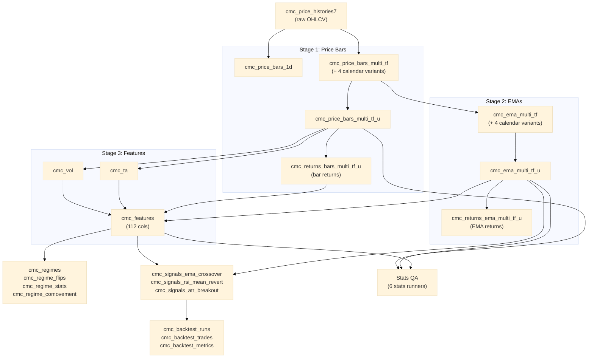

# Phase 31: Documentation Freshness - Research

**Researched:** 2026-02-22
**Domain:** Documentation maintenance — version strings, mkdocs build, stale references, pipeline diagram
**Confidence:** HIGH

---

## Summary

Phase 31 is a documentation accuracy and build-tooling phase. The system is at v0.7.0+ but all
user-facing docs still say v0.4.0 or v0.5.0. The mkdocs nav references two files that do not
exist (`ARCHITECTURE.md`, `CHANGELOG.md` in docs/), which causes `mkdocs build --strict` to fail.
Several doc files contain links to missing targets (`.emf` image files from DOCX conversion,
`../ARCHITECTURE.md` from inside docs subfolders). The existing pipeline diagram
(`docs/diagrams/data_flow.mmd`) shows the v0.5.0 file-migration story — it needs to be replaced
with the actual v0.7.0+ data pipeline architecture (bars → EMAs → features → regimes → signals
→ backtest → stats). Four `[TODO:]` placeholders remain in `docs/ops/update_price_histories_and_emas.md`.
Aspirational alembic commands appear in both `README.md` and `docs/index.md`.

**Primary recommendation:** Fix files in this order: (1) version bump in pyproject.toml + README.md
+ mkdocs.yml, (2) new pipeline diagram, (3) mkdocs.yml nav fixes + exclude_docs pattern,
(4) stale reference sweep (alembic + black in docs/index.md + version strings in DESIGN.md /
deployment.md), (5) TODO resolution in ops doc, (6) CI docs job.

---

## Standard Stack

### Core tools

| Tool | Version | Purpose | Notes |
|------|---------|---------|-------|
| mkdocs | 1.6.1 (installed) | Static site builder | pyproject.toml pins `>=9.0` for material |
| mkdocs-material | 9.5.50 (usable) / 9.7.2 (latest) | Theme | 9.7.2 has a colorama Windows crash bug (see Pitfalls) |
| mkdocstrings[python] | 1.0.3 | Auto API docs from docstrings | |
| Mermaid | (JS, rendered by browser) | Diagram syntax | `.mmd` files stored in `docs/diagrams/` |

### Python version check

```bash
# After bumping pyproject.toml to 0.8.0 and reinstalling:
python -c "import importlib.metadata; print(importlib.metadata.version('ta_lab2'))"
# Returns: "0.8.0"
```

**Installation for docs work:**

```bash
pip install -e ".[docs]"   # mkdocs-material>=9.0 + mkdocstrings[python]>=0.24
```

---

## Current State Audit

### DOCS-01: Version strings (all stale)

| File | Current version string | Location | Fix |
|------|----------------------|----------|-----|
| `pyproject.toml` | `0.5.0` | line 7: `version = "0.5.0"` | Change to `"0.8.0"` |
| `README.md` | `v0.5.0` | line 1: `# ta_lab2 v0.5.0` | Change to `v0.8.0` |
| `mkdocs.yml` | `v0.4.0` | line 1: `site_name: ta_lab2 v0.4.0` | Change to `v0.8.0` |
| `docs/index.md` | `v0.4.0` | line 1: `# ta_lab2 v0.4.0` | Change to `v0.8.0` |
| `docs/DESIGN.md` | `0.4.0` | line 3: `Version: 0.4.0` | Change to `0.8.0` |
| `docs/deployment.md` | `0.4.0` | line 3: `Version: 0.4.0` AND line 962: `*Version: 0.4.0 release candidate*` | Change both |

The CI `version-check` job (in `.github/workflows/ci.yml`) currently checks
`pyproject.toml == README.md` only. Recommend extending it to also check `mkdocs.yml` (optional
per CONTEXT.md discretion item).

### DOCS-02: Pipeline diagram

`docs/diagrams/data_flow.mmd` currently shows the **v0.5.0 file-migration story** (ProjectTT →
data_tools → fredtools2 → .archive/). This is entirely wrong for the purpose specified.

The diagram needs to show the **data processing pipeline** for v0.7.0+:

```
price_histories7
    └─> bars (6 variants + _u)
         ├─> bar returns (6 variants + _u)
         └─> EMAs (6 variants + _u)
              └─> EMA returns (6 variants + _u)
     cmc_vol (from bars)
     cmc_ta  (from bars)
          \_ cmc_features (from vol + ta + emas + bar returns)
               └─> cmc_regimes / cmc_regime_flips / cmc_regime_stats / cmc_regime_comovement
               └─> cmc_signals_ema_crossover / cmc_signals_rsi_mean_revert / cmc_signals_atr_breakout
                    └─> cmc_backtest_runs / cmc_backtest_trades / cmc_backtest_metrics
                         └─> Stats QA tables
```

**Confirmed actual table names** (from codebase inspection, HIGH confidence):

**Bars (Stage 1):**
- Source: `cmc_price_histories7` (raw OHLCV)
- `cmc_price_bars_1d` (canonical 1D)
- `cmc_price_bars_multi_tf` (rolling multi-TF)
- `cmc_price_bars_multi_tf_cal_iso`, `cmc_price_bars_multi_tf_cal_us` (calendar)
- `cmc_price_bars_multi_tf_cal_anchor_iso`, `cmc_price_bars_multi_tf_cal_anchor_us` (anchor)
- `cmc_price_bars_multi_tf_u` (unified, INSERT ... ON CONFLICT DO NOTHING sync pattern)
- Bar returns mirror: `cmc_returns_bars_multi_tf` + 4 calendar variants + `cmc_returns_bars_multi_tf_u`

**EMAs (Stage 2):**
- `cmc_ema_multi_tf`, `cmc_ema_multi_tf_cal` (iso+us), `cmc_ema_multi_tf_cal_anchor` (iso+us)
- `cmc_ema_multi_tf_u` (unified — this is what signals query directly)
- EMA returns: `cmc_returns_ema_multi_tf` + 4 calendar variants + `cmc_returns_ema_multi_tf_u`

**Features (Stage 3) — via `run_all_feature_refreshes.py`:**
- `cmc_vol` (volatility: Parkinson, Garman-Klass, Rogers-Satchell) — reads from `cmc_price_bars_multi_tf`
- `cmc_ta` (technical indicators: RSI, MACD, Bollinger, ATR, ADX) — reads from `cmc_price_bars_multi_tf`
- `cmc_features` (112-col bar-level feature store) — reads from `cmc_vol` + `cmc_ta` + `cmc_ema_multi_tf_u` + `cmc_returns_bars_multi_tf_u`

**Regimes (Stage 4) — via `refresh_cmc_regimes.py`:**
- `cmc_regimes` (PK: id, ts, tf)
- `cmc_regime_flips`
- `cmc_regime_stats`
- `cmc_regime_comovement`

**Signals (Stage 5) — read from `cmc_features` + `cmc_ema_multi_tf_u`:**
- `cmc_signals_ema_crossover`
- `cmc_signals_rsi_mean_revert`
- `cmc_signals_atr_breakout`

**Backtest (Stage 6):**
- `cmc_backtest_runs`
- `cmc_backtest_trades`
- `cmc_backtest_metrics`

**Stats/QA (Stage 7) — 6 stats runners:**
- `cmc_bar_stats` (from `ta_lab2.scripts.bars.stats.refresh_price_bars_stats`)
- `cmc_ema_multi_tf_stats` (from `ta_lab2.scripts.emas.stats.multi_tf`)
- `cmc_ema_multi_tf_cal_stats` (from `ta_lab2.scripts.emas.stats.multi_tf_cal`)
- `cmc_ema_multi_tf_cal_anchor_stats` (from `ta_lab2.scripts.emas.stats.multi_tf_cal_anchor`)
- `cmc_returns_ema_stats` (from `ta_lab2.scripts.returns.stats`)
- `cmc_features_stats` (from `ta_lab2.scripts.features.stats`)

**Two-diagram plan** (per CONTEXT.md):
1. Main overview: `price_histories7` → bars → EMAs → features → regimes/signals → backtest → stats
2. Variant detail: the 6-variant structure for bars/EMAs (multi_tf + 4 calendar + _u)

### DOCS-03: Stale references inventory

**Aspirational alembic commands (remove entirely):**

| File | Lines | Content |
|------|-------|---------|
| `README.md` | 463-476 | `### Database Migrations` section with 3 alembic commands |
| `docs/index.md` | 400-412 | `### Database Migrations` section with 3 alembic commands |

Action: Remove the entire "Database Migrations" subsection from both files. Alembic doesn't exist
yet (Phase 33 will add it). Do not leave a placeholder — simply delete that section.

**Aspirational black formatting command:**

| File | Line | Content |
|------|------|---------|
| `docs/index.md` | 391 | `black src/ tests/` in Code Quality section |

Action: Replace `black src/ tests/` with `ruff format src/` (the actual formatter used since
Phase 30). The surrounding `ruff check src/ --fix` line is already correct.

**Version strings in docs (beyond the version-bump files):**

| File | Stale reference | Context |
|------|----------------|---------|
| `docs/DESIGN.md` | `Version: 0.4.0` (line 3) | Header line |
| `docs/DESIGN.md` | `*Version: 0.4.0 release candidate*` (line 509) | Footer note |
| `docs/deployment.md` | `Version: 0.4.0` (line 3) | Header line |
| `docs/deployment.md` | `*Version: 0.4.0 release candidate*` (line 962) | Footer note |
| `docs/index.md` | `# ta_lab2 v0.4.0` (line 1) | Title heading |
| `docs/api/orchestrator.md` | `- **v0.4.0**: Initial orchestrator release...` (line 559) | Historical changelog entry — leave as historical fact |

**README.md stale content:**

| Section | Issue |
|---------|-------|
| Line 1: `# ta_lab2 v0.5.0` | Version bump to v0.8.0 |
| Lines 7-9: `> **v0.5.0 Ecosystem Reorganization Complete**` callout | Update or remove (the ecosystem reorganization is old news) |
| Lines 71, 122: `ta_lab2 follows a unified ecosystem structure after v0.5.0 reorganization` | Update phrasing |
| Lines 543-555: `Latest Release: v0.5.0 (2026-02-04)` changelog section | Update to v0.8.0 and summarize current changes |
| Lines 463-476: alembic Database Migrations section | Remove |

**[TODO:] placeholders — 4 in `docs/ops/update_price_histories_and_emas.md`:**

| Line | Placeholder | Resolution |
|------|------------|------------|
| 191 | `[TODO: fill in canonical post-load row-count check SQL here]` | Replace with: `sql/metrics/current_vs_snapshot_rowcount_comparisson.sql` (file confirmed to exist) |
| 310 | `[TODO: insert path/filename, e.g. refresh_cmc_ema_daily_stats.py]` | Replace with: `python -m ta_lab2.scripts.emas.stats.multi_tf.refresh_ema_multi_tf_stats` |
| 367 | `[TODO: insert path/filename, e.g. refresh_cmc_ema_multi_tf_stats.py]` | Replace with: `python -m ta_lab2.scripts.emas.stats.multi_tf_cal.refresh_ema_multi_tf_cal_stats` |
| 419 | `[TODO: insert path/filename, e.g. refresh_cmc_ema_multi_tf_cal_stats.py]` | Replace with: `python -m ta_lab2.scripts.emas.stats.multi_tf_cal_anchor.refresh_ema_multi_tf_cal_anchor_stats` |

Note: The old ops doc refers to `cmc_ema_daily` tables and a `refresh_cmc_ema_daily_stats.py`
that no longer exists. The TODOs should reference the actual multi-TF stats runners instead.

### DOCS-04: mkdocs build --strict failures

**Build environment:**
- mkdocs 1.6.1 + mkdocs-material 9.5.50 (downgraded from 9.7.2 due to colorama Windows crash)
- pyproject.toml pins `mkdocs-material>=9.0` — this allows 9.7.2 which crashes on Windows with colorama

**FATAL crash (local Windows only, NOT CI):**
```
PermissionError: docs/review/emas/~$multi_tf_3period_review_bars.xlsx
```
The `~$` prefix is an Excel temp lock file. The `.xlsx` files are gitignored so this file
doesn't exist in CI. On local Windows when Excel has the file open, it appears as a permission-
denied locked file that mkdocs tries to copy as a static asset. Fix: add `exclude_docs` pattern
in `mkdocs.yml` to skip `~$*` files and optionally skip `review/` and `qa/` directories entirely
since they contain Excel/CSV analysis artifacts that don't belong in the site.

**mkdocs 1.6.1 supports `exclude_docs`** (confirmed via source inspection):
```yaml
# In mkdocs.yml, add under the top-level config:
exclude_docs: |
  ~$*
  review/
  qa/
  ops/
```

**WARNING → ERROR under --strict (all must be fixed):**

| Warning | Root Cause | Fix |
|---------|-----------|-----|
| `A reference to 'index.md#quick-start' is included in the 'nav' configuration, which is not found` | mkdocs strict mode does not validate anchor nav entries | Remove `#quick-start` anchor from nav: use `Quick Start: index.md` |
| `A reference to 'deployment.md#installation' is included in the 'nav' configuration, which is not found` | Same — anchor nav entries not supported in strict | Remove `#installation` anchor: use `Installation: deployment.md` |
| `A reference to 'ARCHITECTURE.md' is included in the 'nav' configuration, which is not found` | File does not exist in `docs/` | Remove from nav. The content is at `docs/architecture/architecture.md`. Point nav there instead. |
| `A reference to 'CHANGELOG.md' is included in the 'nav' configuration, which is not found` | CHANGELOG.md is at project root, not in `docs/` | Fix by creating `docs/CHANGELOG.md` with `--8<-- "../CHANGELOG.md"` snippet OR update nav to point to `../CHANGELOG.md` (not supported by mkdocs) OR copy root CHANGELOG.md into docs/ as part of the build. Simplest: create `docs/CHANGELOG.md` that contains actual content. |
| `Doc file 'index.md' contains a link '../CHANGELOG.md'` (appears twice) | Same — ../CHANGELOG.md not in docs/ | Fix link to `CHANGELOG.md` (no `../` prefix, once docs/CHANGELOG.md exists) |
| `Doc file 'DESIGN.md' contains a link '../ARCHITECTURE.md'` (appears twice) | File doesn't exist anywhere | Fix to point to `architecture/architecture.md` |
| `Doc file 'DESIGN.md' contains a link '../CONTRIBUTING.md'` | File is at root, not in docs/ | Point to `../CONTRIBUTING.md` if mkdocs resolves root-relative, or create stub in docs/ |
| `Doc file 'DESIGN.md' contains a link '../SECURITY.md'` | Same | Point to `../SECURITY.md` or create stub |
| `Doc file 'api/orchestrator.md' contains a link '../ARCHITECTURE.md'` | File doesn't exist anywhere | Fix to point to `../architecture/architecture.md` |
| `Doc file 'architecture/timeframes.md' contains a link './media/image1.emf'` | EMF file from DOCX conversion doesn't exist | Remove the broken link or replace with text |
| `Doc file 'features/bar-creation.md' contains a link './media/image1.emf'` | Same | Remove the broken link |
| `Doc file 'planning/sofarinmyownwords.md' contains a link './media/image1.emf'` | Same | Remove the broken link |

**Nav structure decision (per CONTEXT.md: "minimal changes, fix broken links, don't restructure"):**

Current nav:
```yaml
nav:
  - Home: index.md
  - Getting Started:
    - Quick Start: index.md#quick-start      # BROKEN - remove anchor
    - Installation: deployment.md#installation  # BROKEN - remove anchor
  - Design:
    - Overview: DESIGN.md
    - Architecture: ARCHITECTURE.md          # BROKEN - file doesn't exist
  - Components:
    - Time Model: time/time_model_overview.md
    - Features: time/returns_volatility.md
    - Signals: time/regime_integration.md
  - Deployment: deployment.md
  - API Reference:
    - Memory API: api/memory.md
    - Orchestrator CLI: api/orchestrator.md
  - Changelog: CHANGELOG.md                  # BROKEN - not in docs/
```

Recommended fixed nav:
```yaml
nav:
  - Home: index.md
  - Getting Started:
    - Quick Start: index.md
    - Installation: deployment.md
  - Design:
    - Overview: DESIGN.md
    - Architecture: architecture/architecture.md   # EXISTS
  - Components:
    - Time Model: time/time_model_overview.md
    - Features: time/returns_volatility.md
    - Signals: time/regime_integration.md
  - Deployment: deployment.md
  - API Reference:
    - Memory API: api/memory.md
    - Orchestrator CLI: api/orchestrator.md
  - Changelog: CHANGELOG.md                       # Will exist once docs/CHANGELOG.md created
```

---

## Architecture Patterns

### Version bump commit strategy

Per CONTEXT.md decision: bump to 0.8.0 in Phase 31. Recommended standalone commit for version
bump only, then subsequent commits for each area (diagram, mkdocs fix, stale refs, CI job).

### mkdocs.yml exclude_docs pattern

```yaml
# Add to mkdocs.yml (top-level key, not nested under any plugin):
exclude_docs: |
  ~$*
  review/
  qa/
  ops/
```

This prevents mkdocs from trying to copy non-markdown artifacts (Excel QA files, locked temp
files) as static assets. The `ops/` directory contains old-format operational guides that are
not in the nav. The `review/` and `qa/` directories are analysis artifacts.

### mkdocstrings and API docs

The mkdocs nav contains `api/memory.md` and `api/orchestrator.md`. These are hand-written API
reference pages, not auto-generated by mkdocstrings. The `mkdocstrings` plugin is configured but
may fail if it tries to import modules that have missing dependencies. Under `--strict`, this
could cause additional errors. The fix strategy from CONTEXT.md is "fix API doc references rather
than disabling strict mode."

### Creating docs/CHANGELOG.md

Simplest approach: create `docs/CHANGELOG.md` with content copied from root `CHANGELOG.md` and
add an entry for v0.8.0. Do not use mkdocs snippets/includes (requires `pymdownx.snippets`
config with `base_path`). Just copy the content directly.

### CI docs job structure

The existing CI jobs in `.github/workflows/ci.yml` use a consistent pattern:
```yaml
  docs:
    runs-on: ubuntu-latest
    steps:
      - name: Checkout
        uses: actions/checkout@v4
      - name: Set up Python
        uses: actions/setup-python@v5
        with:
          python-version: "3.12"
      - name: Install docs deps
        run: pip install -e ".[docs]"
      - name: Build docs (strict)
        run: mkdocs build --strict
```

This is the exact pattern to follow. Ensure `.[docs]` installs a compatible mkdocs-material
version (see Pitfalls section for the 9.7.2 colorama bug — may need to pin to `<9.7`).

---

## Don't Hand-Roll

| Problem | Don't Build | Use Instead | Why |
|---------|-------------|-------------|-----|
| Diagram syntax for pipeline | Custom SVG or PNG | Mermaid `.mmd` file | Already established pattern in `docs/diagrams/`; renders in GitHub UI and mkdocs |
| Handling CHANGELOG at root vs docs/ | Custom build script | Copy to `docs/CHANGELOG.md` | mkdocs can't serve files outside `docs/` without config changes |
| Exclude lock files from mkdocs | Gitignore entries | `exclude_docs:` in `mkdocs.yml` | mkdocs 1.6.1 has native support |

---

## Common Pitfalls

### Pitfall 1: mkdocs-material 9.7.2 colorama crash on Windows

**What goes wrong:** `mkdocs build` crashes with `UnicodeEncodeError` before producing any output.
The material plugin at startup prints a Unicode warning box character via colorama, which fails
with the Windows cp1252 codec.

**Why it happens:** mkdocs-material 9.7.2 added a runtime warning about mkdocs 2.0 compatibility
using Unicode box-drawing characters. The colorama ANSI-to-Win32 converter fails when writing
those characters to a cp1252 console.

**How to avoid:** In `pyproject.toml` docs dependencies, pin to `mkdocs-material>=9.0,<9.7`.
In CI (Ubuntu), 9.7.2 works fine. On Windows dev machines, use `<9.7`.

**Warning signs:** Build crashes immediately after `INFO - Cleaning site directory` with no
documentation output and a colorama traceback.

### Pitfall 2: Anchor-based nav entries in mkdocs strict mode

**What goes wrong:** `index.md#quick-start` in the nav generates a warning in strict mode even
though the `## Quick Start` heading exists in the file.

**Why it happens:** mkdocs strict mode validates nav entries as file paths, not as page+anchor
combinations. The anchor suffix causes the validation to fail.

**How to avoid:** Remove anchors from nav entries. Use `Quick Start: index.md` and rely on the
ToC for in-page navigation.

### Pitfall 3: mkdocstrings import failures under strict mode

**What goes wrong:** mkdocstrings tries to import Python modules to generate API docs. If the
modules have optional dependencies not installed in the CI docs environment, it fails.

**Why it happens:** The `show_source: true` option causes mkdocstrings to import and introspect
each module. Modules that import from orchestrator/mem0ai/chromadb will fail if those packages
aren't installed.

**How to avoid:** The `api/memory.md` and `api/orchestrator.md` pages appear to be hand-written
(no `::: module.path` directives visible in first read), so mkdocstrings may not actually
introspect those files. Verify there are no `::: ta_lab2.*` directives in the nav files before
assuming this is a problem.

### Pitfall 4: `docs/index.md` vs `README.md` duplication

**What goes wrong:** Both files exist with similar but diverged content. Updating one and not
the other causes inconsistency.

**Why it happens:** Both files were maintained in parallel. `docs/index.md` shows v0.4.0,
README.md shows v0.5.0, and the actual version is v0.8.0.

**How to avoid:** Update both files in the same commit. The files serve different purposes
(docs/index.md = mkdocs homepage, README.md = GitHub landing page) so they can't be merged,
but version strings must match.

### Pitfall 5: `docs/review/emas/~$` temp file

**What goes wrong:** On Windows with Excel open, `~$multi_tf_3period_review_bars.xlsx` exists as
a locked temporary file. mkdocs tries to copy it as a static asset and fails with
`PermissionError`.

**Why it happens:** Excel creates `~$filename.xlsx` lock files when a file is open. These are
excluded by `.gitignore` (which has `*.xlsx`) so they don't appear in git, but mkdocs scans the
local filesystem.

**How to avoid:** Add `exclude_docs: |` with `~$*` pattern to `mkdocs.yml`. Also close Excel
before running `mkdocs build` locally. CI is unaffected (no Excel, no .xlsx files checked in).

---

## Code Examples

### Mermaid flowchart for pipeline diagram



### mkdocs.yml exclude_docs pattern (confirmed syntax, mkdocs 1.6.1)

```yaml
exclude_docs: |
  ~$*
  review/
  qa/
  ops/
```

### CI docs job (pattern matches existing CI jobs)

```yaml
  docs:
    runs-on: ubuntu-latest
    steps:
      - name: Checkout
        uses: actions/checkout@v4
      - name: Set up Python
        uses: actions/setup-python@v5
        with:
          python-version: "3.12"
      - name: Install docs deps
        run: pip install -e ".[docs]"
      - name: Build docs (strict)
        run: mkdocs build --strict
```

### version-check CI extension (optional per CONTEXT.md)

```yaml
      - name: Check version consistency
        run: |
          PYPROJECT_VER=$(grep -oP '^version = "\K[^"]+' pyproject.toml)
          README_VER=$(head -1 README.md | grep -oP 'v\K[0-9]+\.[0-9]+\.[0-9]+')
          MKDOCS_VER=$(grep -oP 'site_name:.*v\K[0-9]+\.[0-9]+\.[0-9]+' mkdocs.yml)
          if [ "$PYPROJECT_VER" != "$README_VER" ] || [ "$PYPROJECT_VER" != "$MKDOCS_VER" ]; then
            echo "::error::Version mismatch: pyproject.toml=$PYPROJECT_VER, README=$README_VER, mkdocs=$MKDOCS_VER"
            exit 1
          fi
          echo "Version consistent: $PYPROJECT_VER"
```

---

## State of the Art

| Old | Current | Impact |
|-----|---------|--------|
| `black` for formatting | `ruff format` (Phase 30) | Remove `black src/ tests/` from docs/index.md Code Quality section |
| `cmc_returns_daily` table | Deprecated; `cmc_returns_bars_multi_tf_u` | README/docs pipeline descriptions refer to old table names |
| `cmc_daily_features` table name | Now `cmc_features` (112-col bar-level store) | Docs/README mention `cmc_daily_features` — update to `cmc_features` |
| `run_daily_refresh.py --all` = bars + EMAs | Now = bars + EMAs + regimes + stats | DAILY_REFRESH.md in docs/operations/ only covers bars + EMAs |
| Aspirational alembic | Alembic not installed (Phase 33 will add it) | Remove alembic sections from README and docs/index.md |
| data_flow.mmd = file migration diagram | Needs to be data pipeline diagram | Replace content entirely |

---

## Open Questions

1. **mkdocstrings under strict mode**
   - What we know: `api/memory.md` and `api/orchestrator.md` are hand-written pages. Quick
     scan shows no `::: ta_lab2.*` autodoc directives visible.
   - What's unclear: Whether mkdocstrings will try to introspect anything at build time even
     without directives.
   - Recommendation: Run `mkdocs build --strict` after fixing nav and link errors to see if
     mkdocstrings generates additional errors. If so, check if `.[docs]` installs the needed
     optional deps.

2. **CONTRIBUTING.md and SECURITY.md links in DESIGN.md**
   - What we know: `DESIGN.md` links to `../CONTRIBUTING.md` and `../SECURITY.md` (root files).
     These generate warnings under strict mode because they're outside `docs/`.
   - What's unclear: Whether mkdocs resolves `../` relative to `docs_dir` (in which case it
     would find root-level files) or whether it treats them as invalid.
   - Recommendation: The simplest fix is to change the links to absolute GitHub URLs or just
     remove the "See Also" section in DESIGN.md (it's a minor footer note). Do not create stub
     copies of CONTRIBUTING.md/SECURITY.md in docs/ — that creates maintenance burden.

3. **mkdocs-material version pin for CI**
   - What we know: 9.7.2 crashes on Windows due to colorama; 9.5.50 works.
   - What's unclear: Whether CI (Ubuntu) would also crash on 9.7.2 (likely not, since colorama
     behaves differently on Linux).
   - Recommendation: In `pyproject.toml` docs deps, use `mkdocs-material>=9.0,<9.7` to keep
     both local Windows and CI working. The CI job can then use `pip install -e ".[docs]"` safely.

---

## Sources

### Primary (HIGH confidence)

- Direct codebase inspection: `pyproject.toml`, `mkdocs.yml`, `README.md`, `docs/index.md`,
  `docs/DESIGN.md`, `docs/deployment.md`, `docs/diagrams/data_flow.mmd`
- Direct codebase inspection: `src/ta_lab2/scripts/run_daily_refresh.py`,
  `src/ta_lab2/scripts/features/run_all_feature_refreshes.py`,
  `src/ta_lab2/scripts/stats/run_all_stats_runners.py`
- Live `mkdocs build --strict` run: warnings and errors captured directly (mkdocs 1.6.1 +
  mkdocs-material 9.5.50, project directory as cwd)
- `docs/ops/update_price_histories_and_emas.md`: all 4 `[TODO:]` lines located and confirmed
- `docs/index.md`: `black` and `alembic` stale references confirmed at specific lines
- `README.md`: `alembic` Database Migrations section confirmed at lines 463-476
- `.github/workflows/ci.yml`: full CI structure read; existing `version-check` job confirmed

### Secondary (MEDIUM confidence)

- mkdocs 1.6.1 `exclude_docs` support: confirmed via `inspect.getsource()` of
  `mkdocs.config.defaults` — `exclude_docs = c.Optional(c.PathSpec())` present with docstring.

---

## Metadata

**Confidence breakdown:**
- Version string locations: HIGH — directly read from files
- mkdocs errors: HIGH — live `mkdocs build --strict` executed
- Pipeline table names: HIGH — read from actual refresh scripts and SQL DDL files
- TODO resolutions: HIGH — actual stats runner module paths confirmed from `run_all_stats_runners.py`
- mkdocstrings strict behavior: LOW — not directly tested (no `::: ` directives seen but not exhaustively scanned)
- mkdocs-material 9.7.2 CI behavior on Ubuntu: MEDIUM — Windows-confirmed crash, Linux behavior inferred from colorama difference

**Research date:** 2026-02-22
**Valid until:** 2026-03-08 (stable — mkdocs versions and file locations won't change)
