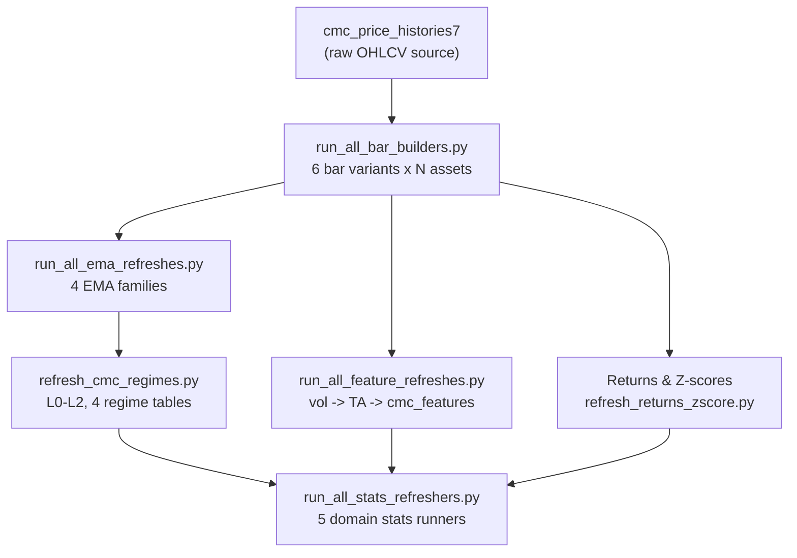

# Architecture Patterns: v0.8.0 Polish & Hardening

**Domain:** Quant trading data platform — hardening existing infrastructure
**Researched:** 2026-02-22
**Confidence:** HIGH (all findings from direct codebase inspection)

---

## Existing System Map

The current system has a clear orchestration spine: one top-level script,
`run_daily_refresh.py`, invokes child processes via `subprocess.run()` in
sequential stages. Each stage has its own sub-orchestrator.

```
run_daily_refresh.py --all
  |
  +-- subprocess --> bars/run_all_bar_builders.py
  |                   (6 bar builders in sequence)
  |
  +-- subprocess --> emas/run_all_ema_refreshes.py
  |                   (4 EMA refreshers + sync scripts)
  |
  +-- subprocess --> regimes/refresh_cmc_regimes.py
                      (L0-L2 labeling, 4 regime tables)

NOT wired in (manual-only, all functional):
  bars/stats/refresh_price_bars_stats.py           --> price_bars_multi_tf_stats
  emas/stats/run_all_stats_refreshes.py            --> 3 EMA *_stats tables
  features/stats/refresh_cmc_features_stats.py     --> cmc_features_stats
  returns/stats/run_all_returns_stats_refreshes.py --> returns EMA stats tables
  prices/refresh_price_histories7_stats.py         --> price_histories7_stats
```

**Pattern inside each stage:** `subprocess.run(cmd, check=False, capture_output=True,
text=True)` wrapped in a `ComponentResult` dataclass. Failures print stdout/stderr
only on non-zero exit code. The orchestrator decides whether to halt or continue
based on `--continue-on-error`.

---

## Area 1: Stats / QA Integration

### Existing Components

The 5 stats runners are fully built scripts with watermark-based incrementality. Each:
- Creates its own `*_stats` and `*_stats_state` tables via inline DDL
  (`CREATE TABLE IF NOT EXISTS`) at startup — no external DDL files needed
- Checks `ingested_at` (or `updated_at`) watermark against last run; no-ops on
  no new data
- Runs SQL tests (PK uniqueness, OHLC consistency, freshness lag, row-count vs span)
- Writes PASS/WARN/FAIL rows into the stats table and advances the watermark

They are idempotent and safe to run after any refresh.

**Existing stats sub-orchestrators (partial coverage):**
- `emas/stats/run_all_stats_refreshes.py` — covers 3 EMA family stats scripts
- `returns/stats/run_all_returns_stats_refreshes.py` — covers 6 returns family stats

**Standalone runners (no parent orchestrator yet):**
- `bars/stats/refresh_price_bars_stats.py` — uses `--full-refresh` flag (not `--ids`)
- `features/stats/refresh_cmc_features_stats.py` — uses `--full-refresh` flag
- `prices/refresh_price_histories7_stats.py` — has its own invocation style

### Integration Point

`run_daily_refresh.py` already has a `run_regime_refresher()` function that is the
exact pattern to replicate. Adding stats means:

1. Write `src/ta_lab2/scripts/run_all_stats_refreshers.py` — a new top-level
   orchestrator that calls all 5 runners (bars stats, EMA stats, features stats,
   returns stats, prices stats) via the same `subprocess.run()` pattern
2. Add a `run_stats_refreshers()` helper function to `run_daily_refresh.py`
3. Add a `--stats` CLI flag to `run_daily_refresh.py`
4. Include `--stats` in the `--all` execution chain as the final stage

**Why stats is last in `--all`:**
Stats validates freshness (`max_ts_lag_vs_price`) and row-counts against the data
that all prior stages wrote. If stats runs before bars complete, freshness checks
would reflect the previous run's data.

**Proposed `--all` call chain:**

```
bars --> EMAs --> regimes --> stats
```

**The `--ids` argument does NOT carry through to stats runners.** Stats runners
query the DB directly and determine impacted keys from the watermark; they do not
accept per-asset ID filtering.

### New Components Needed

| Component | Location | What It Does |
|-----------|----------|-------------|
| `run_all_stats_refreshers.py` | `src/ta_lab2/scripts/` | Top-level orchestrator; calls all 5 stats runners via subprocess |
| `run_stats_refreshers()` function | In `run_daily_refresh.py` | Wrapper that invokes `run_all_stats_refreshers.py` subprocess |
| `--stats` flag | `run_daily_refresh.py` argparser | Enables stats-only and stats-as-part-of-`--all` |

### Modified Components

| Component | Change |
|-----------|--------|
| `src/ta_lab2/scripts/run_daily_refresh.py` | Add `run_stats_refreshers()`, `--stats` flag, include in `--all` chain |

---

## Area 2: Code Quality (mypy + ruff blocking)

### Existing State

- `pyproject.toml` has `[tool.ruff.lint]` with `ignore = ["E402"]`
- `pyproject.toml` has no `[tool.mypy]` section despite `mypy>=1.8` being in `dev` deps
- `.pre-commit-config.yaml`: ruff runs with `--fix --exit-non-zero-on-fix` — blocks
  local commits if lint fails with auto-fixes applied
- `ci.yml` lint job: `ruff check src || true` — deliberately non-blocking in CI
- `validation.yml` circular-dependency job (`import-linter`) is blocking; ruff is not

### Integration Point: Ruff Blocking

The `ci.yml` lint job needs one-line change:

```yaml
# Current (non-blocking):
ruff check src || true

# Target (blocking):
ruff check src
ruff format --check src
```

**Risk assessment:** The `|| true` exists because there are active lint violations in
the codebase. Flipping without auditing first will break CI immediately. Required
pre-work: run `ruff check src` locally, count violations, apply `ruff --fix` where
safe, commit clean state, then flip CI.

Ruff format checking (`--check` flag) is new — format violations are not currently
checked in CI (only locally via pre-commit). Add it separately from lint blocking
to isolate failure modes.

### Integration Point: mypy

No `[tool.mypy]` section exists in `pyproject.toml`. Add:

```toml
[tool.mypy]
python_version = "3.11"
warn_return_any = true
warn_unused_configs = true
ignore_missing_imports = true
exclude = [
    "src/ta_lab2/tools/",
    "src/ta_lab2/scripts/baseline/",
    ".archive/",
    ".venv311/",
]
```

`ignore_missing_imports = true` is mandatory. The codebase uses conditional imports
for vectorbt, astronomy-engine, and fredapi which are not installed in CI's core
environment (`.[dev]`). Without this flag, mypy will error on every file that touches
those dependencies.

**CI job to add to `ci.yml`:**

```yaml
- name: Type check (mypy)
  run: |
    mypy src/ta_lab2 || true   # non-blocking initially
```

Initial mypy run on a codebase this size will surface dozens to hundreds of errors.
Strategy: add config and non-blocking CI first, fix errors domain by domain, then
remove `|| true` once a domain is clean.

### Modified Components

| Component | Change |
|-----------|--------|
| `pyproject.toml` | Add `[tool.mypy]` section |
| `.github/workflows/ci.yml` | Remove `|| true` from ruff lint; add mypy job (non-blocking) |

---

## Area 3: Documentation (mkdocs version + pipeline diagram)

### Existing State

- `mkdocs.yml` line 1: `site_name: ta_lab2 v0.4.0` — three major versions behind
  actual v0.7.0
- `pyproject.toml` line 7: `version = "0.5.0"` — also stale (should track
  current milestone)
- `docs/diagrams/data_flow.mmd` depicts the v0.5.0 migration story (Phase 13-15
  archive/consolidation) — not the current runtime pipeline
- `docs/operations/DAILY_REFRESH.md` covers bars + EMAs only; no regimes section,
  no stats section, no features pipeline section
- `mkdocs.yml` nav references `ARCHITECTURE.md` at docs root — that file does not
  exist (nav is broken)

### Integration Point: Version Sync

Both `mkdocs.yml` (`site_name`) and `pyproject.toml` (`version`) must be updated
together to avoid drift. The natural tie-in is a single commit that bumps both. No
automated version sourcing exists — both are hardcoded strings.

### Integration Point: Pipeline Diagram

The existing `docs/diagrams/data_flow.mmd` is the right file to replace. It uses
Mermaid syntax consistent with the `pymdownx.superfences` extension already configured
in `mkdocs.yml`. The replacement should depict the v0.7.0+ runtime pipeline:



### Integration Point: DAILY_REFRESH.md

The existing runbook must be updated in two places:

1. **Entry Points section** — add `--regimes` and `--stats` flags with descriptions
   (matching the existing flags table format)
2. **Troubleshooting section** — add common regimes and stats failure patterns

The existing document structure (Quick Start / Entry Points / Execution Order / Logs /
Troubleshooting / Workflow Patterns / Cron Setup / Performance / See Also) should not
change. New content slots in under existing headers.

### Modified Components

| Component | Change |
|-----------|--------|
| `mkdocs.yml` | Update `site_name` version string to v0.8.0 |
| `pyproject.toml` | Update `version` field to match |
| `docs/diagrams/data_flow.mmd` | Replace with current pipeline diagram |
| `docs/operations/DAILY_REFRESH.md` | Add regimes + stats sections |

---

## Area 4: Runbooks

### Existing Convention

`docs/operations/` holds operational runbooks. Current runbooks:
- `DAILY_REFRESH.md` — the canonical format; covers bars + EMAs refresh
- `STATE_MANAGEMENT.md` — covers state table schemas and SQL queries

The established section structure is:
```
Quick Start → Entry Points → Execution Order → Logs and Monitoring
→ Troubleshooting → Workflow Patterns → Cron Setup → Performance → See Also
```

### What Is Missing

No runbooks exist for:
- Stats runners (5 runners across 5 domains)
- Feature refresh pipeline (`run_all_feature_refreshes.py`)
- Regimes pipeline (wired into daily refresh since v0.7.0 but not documented as
  a standalone runbook)

### New Runbook Placement and Content

**`docs/operations/STATS_RUNNERS.md`** — New file covering:
- What stats runners do (QA/validation, not production data)
- How to interpret PASS/WARN/FAIL results
- Per-domain runner invocation (bars, EMA, features, returns, prices)
- What each stats table contains and where to query it
- Common failure patterns (watermark drift, missing data source)
- When to use `--full-refresh` to reset watermarks

**`docs/operations/FEATURES_PIPELINE.md`** — New file covering:
- Dependency on bars + EMAs being current before running
- The `--tf` and `--all-tfs` flags
- How vol, TA, and cmc_features are layered
- Column schema (the 112-column cmc_features table)
- What "dynamic column matching" means in practice
- Common errors (column mismatch, missing dependency data)

**Regimes:** Do NOT create a separate regimes runbook. Regimes are already wired into
`run_daily_refresh.py --regimes`. Add a "Regimes" subsection to `DAILY_REFRESH.md`
under Entry Points (consistent with how `--bars` and `--emas` are documented).

### mkdocs nav Integration

New runbooks must be added to `mkdocs.yml` nav under an appropriate section.
Currently the nav has no `Operations` section — one should be added:

```yaml
nav:
  - Operations:
    - Daily Refresh: operations/DAILY_REFRESH.md
    - State Management: operations/STATE_MANAGEMENT.md
    - Stats Runners: operations/STATS_RUNNERS.md
    - Features Pipeline: operations/FEATURES_PIPELINE.md
```

### New / Modified Components

| Component | Type |
|-----------|------|
| `docs/operations/STATS_RUNNERS.md` | New file |
| `docs/operations/FEATURES_PIPELINE.md` | New file |
| `docs/operations/DAILY_REFRESH.md` | Modified — add regimes and stats subsections |
| `mkdocs.yml` | Modified — add Operations nav section |

---

## Area 5: Alembic

### Existing State

- No alembic present — zero alembic files found in the entire repository
- 16 raw SQL files in `sql/migration/` with mixed naming conventions:
  - 8 files use `NNN_description.sql` (e.g., `016_dim_timeframe_*.sql`)
  - 8 files use `alter_*` or `rebuild_*` prefix (no sequential number)
- Stats runners and some refreshers create tables via inline `CREATE TABLE IF NOT
  EXISTS` Python strings — not tracked in any external DDL
- Separate `sql/ddl/` directory holds creation DDL for core tables

### Bootstrap Strategy

Bootstrapping alembic against a live database that already has all tables applied
requires "stamp without migrate":

1. `pip install alembic` (already in `dev` deps in `pyproject.toml`)
2. `alembic init alembic` at project root — creates `alembic/` directory and `alembic.ini`
3. Edit `alembic.ini`: point `script_location` at `alembic/`, leave `sqlalchemy.url`
   empty (will be set in `env.py`)
4. Edit `alembic/env.py` to resolve DB URL from the existing config pattern:

   ```python
   from ta_lab2.scripts.refresh_utils import resolve_db_url
   config.set_main_option("sqlalchemy.url", resolve_db_url(None))
   ```

5. Create an initial "baseline" migration that is intentionally empty:

   ```bash
   alembic revision -m "0001_baseline_stamp"
   # Edit the generated file: upgrade() = pass, downgrade() = pass
   ```

6. Stamp the live database without running any DDL:

   ```bash
   alembic stamp head
   ```

From this point forward, all new schema changes go through `alembic revision`.

### Handling the Existing 16 SQL Migration Files

These files document what was applied historically. They should **not** be imported
into alembic. They are already applied to the live database. Alembic takes over from
this point forward only. Recommended action: add a comment to `sql/migration/README.md`
(or the top of each file) noting "applied manually before alembic was introduced; do
not re-run."

### Handling Inline DDL in Stats Runners

Stats runners use `CREATE TABLE IF NOT EXISTS` to create their own QA tables at
runtime. This creates a minor conflict with alembic as the canonical schema source.

**Recommended approach (Option A):** Keep inline DDL for stats tables as-is. They are
self-managing QA tables with no downstream consumers other than their own runner.
Document in the baseline migration that these tables exist but are managed externally.
This adds zero risk and zero scope.

**Alternative (Option B):** Extract stats table DDL into alembic migrations and remove
inline DDL from runners. More consistent but requires touching every stats runner
script. Appropriate for a later polish cycle, not for the hardening milestone.

### Naming Convention for Future Migrations

Embed the human-readable sequential number in the migration message since alembic
manages its own hash-based revision IDs:

```bash
alembic revision -m "0022_add_audit_results_table"
alembic revision -m "0023_add_table_summary_table"
```

This makes `alembic history` readable without losing alembic's native revision chain.
The existing `sql/migration/` directory coexists for historical reference.

### New / Modified Components

| Component | Type | Notes |
|-----------|------|-------|
| `alembic/` directory | New | Created by `alembic init` |
| `alembic.ini` | New | Config at project root |
| `alembic/env.py` | New (generated, edited) | Wired to `resolve_db_url()` |
| `alembic/versions/0001_baseline_stamp.py` | New | Empty upgrade/downgrade |
| `pyproject.toml` dev deps | Modified | Add `alembic>=1.13` |
| `sql/migration/` | No change | Keep as historical reference |

---

## Full Component Inventory: New vs Modified

### Modified (existing files changed)

| Component | What Changes |
|-----------|-------------|
| `src/ta_lab2/scripts/run_daily_refresh.py` | Add `run_stats_refreshers()`, `--stats` flag, include in `--all` |
| `pyproject.toml` | Add `[tool.mypy]`, update `version`, add `alembic>=1.13` to dev |
| `.github/workflows/ci.yml` | Remove `|| true` from ruff lint; add non-blocking mypy job |
| `mkdocs.yml` | Update version string; add Operations nav section |
| `docs/diagrams/data_flow.mmd` | Replace with current v0.7.0+ pipeline diagram |
| `docs/operations/DAILY_REFRESH.md` | Add regimes subsection, add stats subsection |

### New (files that do not yet exist)

| Component | Purpose |
|-----------|---------|
| `src/ta_lab2/scripts/run_all_stats_refreshers.py` | Top-level stats orchestrator |
| `docs/operations/STATS_RUNNERS.md` | Operations runbook for stats runners |
| `docs/operations/FEATURES_PIPELINE.md` | Operations runbook for feature refresh |
| `alembic/` directory + `alembic.ini` | Migration tooling bootstrap |
| `alembic/versions/0001_baseline_stamp.py` | Empty baseline migration |

---

## Data Flow Changes

### Current (v0.7.0)

```
run_daily_refresh.py --all
  bars -> EMAs -> regimes
  [stats: manual, each runner invoked separately]
```

### Target (v0.8.0)

```
run_daily_refresh.py --all
  bars -> EMAs -> regimes -> stats

run_daily_refresh.py --stats     (standalone, safe to run anytime)
```

No changes to what data is written or how — only orchestration topology changes.
The 5 stats runners already exist and are complete; only wiring changes.

---

## Suggested Build Order

This order minimizes risk at each step and allows each step to be validated before
the next begins.

**Step 1 — Stats orchestrator (new file) + wire into daily refresh**

Build `run_all_stats_refreshers.py` first (collecting the 5 existing runners via the
same subprocess/ComponentResult pattern as the existing EMA stats orchestrator).
Then add `run_stats_refreshers()` to `run_daily_refresh.py` and the `--stats` flag.

Test sequence: `--stats --dry-run`, then `--stats` alone, then `--all --dry-run`,
then `--all` with `--continue-on-error`. This is entirely new code that does not
modify any existing execution paths.

**Step 2 — Alembic bootstrap**

Bootstrap alembic and stamp the live DB before any new schema changes land in v0.8.0.
The stamp is a read-only DB operation — no DDL runs, no tables touched. This creates
the migration tracking infrastructure without any risk to existing data.

**Step 3 — Code quality baseline (assess before blocking)**

Run `ruff check src` locally to see current violation count. Apply `ruff --fix`
where safe. Commit the cleaned state. Then flip `|| true` in `ci.yml` to make
ruff blocking. Add `[tool.mypy]` to `pyproject.toml` and the non-blocking mypy
CI job in the same commit. Assess mypy error count before committing to any
specific remediation scope.

**Step 4 — Docs: version sync + pipeline diagram**

Update `mkdocs.yml` and `pyproject.toml` version strings in one commit. Replace
`docs/diagrams/data_flow.mmd` with the current pipeline diagram. Update
`DAILY_REFRESH.md` to add regimes and stats sections (regimes have been wired
since v0.7.0 but the runbook was never updated).

**Step 5 — Runbooks**

Write `STATS_RUNNERS.md` and `FEATURES_PIPELINE.md` last — after Step 1 is done
so the stats runbook accurately describes the integrated workflow. Update `mkdocs.yml`
nav to include the new runbooks.

---

## Architectural Constraints to Respect

**Subprocess isolation is intentional.** The `subprocess.run()` pattern in
`run_daily_refresh.py` is deliberate — each child process has its own import scope
and exception boundary. Stats runners must be wired via subprocess, not imported
and called in-process. This keeps the orchestrator as a thin coordinator.

**Import-linter contracts must not be violated.** Five contracts are defined in
`pyproject.toml`. The new `run_all_stats_refreshers.py` lives in `ta_lab2.scripts`
(the allowed top layer) and only invokes child processes — no cross-layer imports.
This is safe as written.

**Stats tables are self-creating and idempotent.** Each stats runner issues
`CREATE TABLE IF NOT EXISTS` on startup. Re-running is safe. The orchestrator
should not add any deduplication logic — individual runners handle it.

**Alembic `env.py` must use the existing DB URL resolution chain.** The project
uses `resolve_db_url()` from `ta_lab2.scripts.refresh_utils` and `TARGET_DB_URL`
env var. Alembic's `env.py` should wire into this same function. Do not introduce
a second resolution path — that would create a two-source-of-truth problem.

**mypy `ignore_missing_imports = true` is required.** The codebase has conditional
imports (vectorbt, astronomy-engine, fredapi). Without this flag, mypy errors on
every file touching optional deps even when they are guarded by `try/except`.

---

## Integration Risk Summary

| Area | Risk Level | Mitigation |
|------|------------|------------|
| Stats wiring | Low | Stats runners already exist and work; only orchestration wiring is new |
| Ruff blocking | Medium | Unknown lint debt exists (the `\|\| true` is not cosmetic); audit locally first |
| mypy config | Medium | Large codebase; many typing gaps likely; start non-blocking |
| mkdocs version | Low | String updates only; no logic changes |
| Runbooks | Low | No code changes; review against actual `--help` output before publishing |
| Alembic bootstrap | Low | `alembic stamp` is read-only; no DDL runs on live DB |
| Inline stats DDL vs alembic | Low | Keep as-is; document exception; no scripts need touching |
