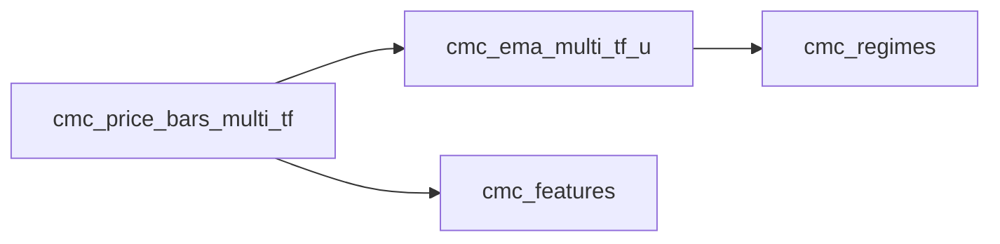

# Technology Stack: v0.8.0 Polish & Hardening

**Project:** ta_lab2
**Milestone:** v0.8.0 — Stats/QA orchestration, code quality, docs, runbooks, Alembic migrations
**Researched:** 2026-02-22
**Overall confidence:** HIGH (all recommendations verified against PyPI or official docs)

---

## Context: What Already Exists (Do Not Re-Research)

The following stack is validated and in production. These are NOT open questions:

| Component | Version in pyproject.toml | Status |
|-----------|--------------------------|--------|
| Python | 3.12 (CI matrix: 3.11, 3.12) | Locked |
| PostgreSQL | 16 (in CI service) | Locked |
| SQLAlchemy | >=2.0 | Locked |
| pandas | (unpinned) | Locked |
| numpy | (unpinned) | Locked |
| vectorbt | 0.28.1 | Locked |
| ruff | >=0.1.5 (in dev deps) | Needs upgrade + enforcement |
| mypy | >=1.8 (in dev deps, no config) | Needs config |
| mkdocs-material | >=9.0 (in docs deps) | Needs update + mermaid |
| mike | (not in pyproject.toml) | Needs explicit pin |
| pre-commit | ruff-pre-commit v0.1.14 | Needs upgrade |
| pytest | >=8.0 | Active |
| import-linter | >=2.7 | Active |

---

## Area 1: Stats/QA Orchestration

### What is needed

The project has 5 existing stats runners (bars, 3x EMA variant, returns, features) that write PASS/WARN/FAIL results to stats tables and a `run_daily_refresh.py` orchestrator. The hardening work wires stats runners into the daily refresh and adds a weekly digest report.

### Stack verdict: NO new libraries required

The digest report needs only stdlib + already-present deps. The recommendation is explicit: **do not introduce Jinja2, Celery, or Airflow**.

| Use Case | Tool | Why |
|----------|------|-----|
| Stats orchestration | stdlib `subprocess` + existing `run_daily_refresh.py` pattern | Already used for bars/EMAs/regimes; same pattern scales |
| Report formatting | stdlib `string.Template` or f-strings | Reports go to Telegram (HTML) and log files; no templating engine needed |
| Telegram digest | `ta_lab2.notifications.telegram` (existing) | `send_message(parse_mode="HTML")` already supports structured HTML |
| Scheduling (weekly digest) | cron / OS scheduler (external) | The codebase already assumes external scheduling; no scheduler library in-process |
| Data aggregation for digest | pandas (existing) + SQLAlchemy (existing) | Query stats tables, aggregate with pandas |

**What NOT to add for this area:**
- **Jinja2**: Overkill for Telegram messages. The existing `telegram.py` sends HTML strings; f-strings are sufficient. Jinja2 adds a dependency for a task that is ~20 lines of formatting code.
- **Celery / APScheduler / Airflow**: All introduce broker dependencies (Redis/RabbitMQ) or daemon processes. The codebase pattern is subprocess-based scripts invoked by cron. Introducing an in-process scheduler breaks this pattern and adds operational complexity.
- **pandas-email-report or similar**: No email channel exists; Telegram is the delivery mechanism.

---

## Area 2: Code Quality — mypy strict + ruff blocking CI

### mypy

**Current state:** `mypy>=1.8` listed in dev deps. No `[tool.mypy]` section in `pyproject.toml`. mypy runs nowhere in CI.

**Recommended version:** `>=1.14` (latest stable is **1.19.1**, released 2025-12-15; constraint `>=1.14` captures recent releases without over-constraining)

**Recommended configuration in `pyproject.toml`:**

```toml
[tool.mypy]
python_version = "3.12"
strict = true

# Exclude scripts that use subprocess/argparse boilerplate with no type benefit
exclude = [
    "src/ta_lab2/scripts/",
    "tests/",
]

# Untyped third-party libraries: suppress errors rather than adding stubs
ignore_missing_imports = true

# Per-module relaxations for known-untyped boundaries
[[tool.mypy.overrides]]
module = [
    "vectorbt.*",
    "psycopg2.*",
    "requests.*",
    "hypothesis.*",
]
ignore_missing_imports = true
ignore_errors = true
```

**Why exclude scripts/:** The `src/ta_lab2/scripts/` subtree contains ~50 orchestration scripts written with argparse, subprocess, and path manipulation. Enforcing strict mypy on all of them as a first pass would produce thousands of errors with low architectural value. The right scope for mypy strict in v0.8.0 is the library layer: `ta_lab2.features`, `ta_lab2.regimes`, `ta_lab2.signals`, `ta_lab2.tools`, `ta_lab2.notifications`.

**Type stubs — what to add:**

| Package | Rationale | Version |
|---------|-----------|---------|
| `pandas-stubs` | pandas is untyped; stubs enable DataFrame column checking in feature code | `>=2.2.0` (matches pandas 2.x, not 3.0) |

**What NOT to add for mypy stubs:**

- **`sqlalchemy-stubs` / `sqlalchemy2-stubs`**: The SQLAlchemy mypy plugin is DEPRECATED and removed in SQLAlchemy 2.1. SQLAlchemy 2.0 is natively PEP-484 compliant when using the new declarative constructs. Do not install stubs packages — they will conflict.
- **`data-science-types`**: Unmaintained since 2021. pandas-stubs is the current standard.
- **numpy stubs**: numpy ships its own `py.typed` marker as of numpy 1.20. No separate stubs package needed.
- **`types-requests`**: Only needed if `requests` is in a typed module. The telegram.py uses `try: import requests except ImportError` — this boundary should be marked `ignore_errors = true` in overrides.

**mypy in CI — recommended approach:**

Add a non-blocking (warning-only) mypy step in `ci.yml` initially, then make it blocking after the first pass of fixes. Do not make it blocking on day one; the existing codebase was written without type annotations and will have numerous failures.

```yaml
- name: mypy type check (library layer)
  run: |
    mypy src/ta_lab2/features/ src/ta_lab2/regimes/ \
         src/ta_lab2/signals/ src/ta_lab2/tools/ \
         src/ta_lab2/notifications/
  continue-on-error: true  # Remove once baseline errors are fixed
```

### ruff

**Current state:** `ruff>=0.1.5` in dev deps; pre-commit at `v0.1.14`; CI runs `ruff check src || true` (non-blocking).

**Current latest stable:** **0.15.2**, released 2026-02-19.

**Recommended version constraint:** `>=0.9.0` in pyproject.toml (captures 0.9.x through 0.15.x; avoids pinning to a specific patch).

**Pre-commit version:** Update `ruff-pre-commit` from `v0.1.14` to `v0.9.0` minimum (or `v0.15.2` for latest). The `v0.1.x` series is over a year old and missing rules.

**Making ruff blocking in CI — minimal change to `ci.yml`:**

Change `ruff check src || true` to:

```yaml
- name: Ruff lint (blocking)
  run: ruff check src --output-format=github

- name: Ruff format check (blocking)
  run: ruff format --check src
```

Removing `|| true` makes the job fail on lint errors. The `--output-format=github` flag produces inline PR annotations.

**Ruff configuration additions to `pyproject.toml`:**

The existing `[tool.ruff.lint]` only has `ignore = ["E402"]`. Add explicit rule selections for a quant codebase:

```toml
[tool.ruff]
line-length = 100

[tool.ruff.lint]
select = ["E", "F", "W", "I", "N", "UP", "ANN"]
ignore = [
    "E402",    # Module-level import (scripts use sys.path manipulation)
    "ANN101",  # Missing type annotation for self (deprecated rule)
    "ANN102",  # Missing type annotation for cls (deprecated rule)
]

[tool.ruff.lint.per-file-ignores]
"tests/*" = ["F841", "ANN"]  # Allow unused vars + skip annotations in tests
"src/ta_lab2/scripts/*" = ["ANN"]  # Scripts exempt from annotation enforcement
```

**What NOT to add for ruff:**
- **pylint**: ruff replaces pylint for standard checks. Do not run both.
- **flake8**: Replaced by ruff. Do not add.
- **bandit (security linting)**: Not in scope for this milestone; would require separate investigation of what rules apply to a quant research codebase.

---

## Area 3: Documentation — mkdocs.yml + mermaid + version sync

### mkdocs-material

**Current version in pyproject.toml:** `>=9.0`
**Current latest stable:** **9.7.2**, released 2026-02-18.

Update the constraint to `>=9.5` to get mermaid fixes and the latest admonition styles, while avoiding any future 10.x breaking changes.

**Mermaid diagrams:** mkdocs-material has **native mermaid support** since version 8.2. No separate `mkdocs-mermaid2-plugin` is needed (that plugin conflicts with dark mode and minification). The native integration requires only a `pymdownx.superfences` extension configuration:

```yaml
# In mkdocs.yml
markdown_extensions:
  - pymdownx.superfences:
      custom_fences:
        - name: mermaid
          class: mermaid
          format: !!python/name:pymdownx.superfences.fence_code_format
```

This is the only change needed to enable mermaid diagrams in documentation. Diagrams then use standard mermaid code blocks:

````markdown

````

### mike (versioning)

**Current state:** Referenced in `mkdocs.yml` under `extra.version.provider: mike`, but not in `pyproject.toml` docs deps.

**Current latest stable:** **2.1.3**, released 2024-08-13. This is the version to pin.

Add to `pyproject.toml` docs optional-dependencies:

```toml
[project.optional-dependencies]
docs = [
  "mkdocs-material>=9.5",
  "mkdocstrings[python]>=0.26",
  "mike>=2.1",
]
```

**Version sync (mkdocs.yml site_name vs pyproject.toml version):** The `mkdocs.yml` currently has `site_name: ta_lab2 v0.4.0` hardcoded. This will diverge from `pyproject.toml version = "0.5.0"`. The fix is a one-line script in CI (no new library):

```bash
# In release CI step, before mkdocs build:
VERSION=$(python -c "import tomllib; print(tomllib.load(open('pyproject.toml','rb'))['project']['version'])")
sed -i "s/site_name: .*/site_name: ta_lab2 v${VERSION}/" mkdocs.yml
```

`tomllib` is stdlib in Python 3.11+. No new dependency needed.

### mkdocstrings

**Current version in pyproject.toml:** `>=1.0` (unusual; mkdocstrings uses `0.x` versioning)

The correct package is `mkdocstrings[python]`, with the handler pinned:

```toml
"mkdocstrings[python]>=0.26",
```

**What NOT to add for docs:**
- **`mkdocs-mermaid2-plugin`**: The third-party plugin has dark mode conflicts and does not work alongside minify. Use native mkdocs-material mermaid support instead.
- **`mkdocs-minify-plugin`**: Not needed for developer documentation; adds build complexity.
- **Sphinx**: mkdocs-material is already established. Do not introduce a second doc system.
- **`mkdocs-git-revision-date-plugin`**: Adds per-page last-modified dates from git history. Cosmetic enhancement; not needed for v0.8.0.

---

## Area 4: Runbooks

### Stack verdict: No library additions — file-based only

Runbooks are operational documentation (Markdown files in `docs/`). They describe how to run the regime and backtest pipelines, what to do when a run fails, and how to interpret PASS/WARN/FAIL from stats tables.

**Format:** Standard Markdown in `docs/runbooks/`, surfaced via mkdocs nav. mermaid diagrams (enabled in Area 3) cover pipeline flow diagrams.

**What NOT to add:**
- **Confluence / Notion integration**: External tools; not needed for a single-developer quant lab.
- **Automated runbook generation**: The content must be written manually; no tool generates operational knowledge.

---

## Area 5: Alembic Migrations

### Current state

16 raw SQL files in `sql/migration/` with mixed naming:
- 6 files numbered `016`–`021` (sequential)
- 10 files with descriptive names, no numbering (applied out-of-band)

No Alembic framework exists. No `alembic.ini`. No `alembic/` directory. Database was built by running SQL files manually.

### Recommended stack

**Alembic version:** **1.18.4** (latest stable, released 2026-02-10).

Add to `pyproject.toml` dev optional-dependencies:

```toml
dev = [
  ...existing dev deps...
  "alembic>=1.15",
]
```

### Integration strategy: wrap-then-stamp

The correct approach for an existing database with raw SQL history is **not** to regenerate migrations from schema reflection (autogenerate), but to **wrap the existing SQL files in Alembic revision scripts** and then stamp the current production database as at `head`. This preserves the SQL logic exactly while establishing migration history tracking.

**Step-by-step approach:**

1. `alembic init alembic` — creates `alembic/` directory with `env.py` and `alembic.ini`
2. Configure `env.py` to use `TARGET_DB_URL` environment variable (consistent with existing stack pattern)
3. Create one Alembic revision per numbered SQL file (016–021), each containing `op.execute(Path("sql/migration/NNN_...sql").read_text(encoding="utf-8"))`
4. Create one "omnibus" revision for the 10 unnumbered files, applied in the order they were actually run (reconstruct from git history / commit dates)
5. `alembic stamp head` against production — tells Alembic the DB is already at the latest revision without running any SQL
6. Future schema changes use `alembic revision --autogenerate` or manual revision files

**Critical Windows note from project MEMORY:** SQL files contain UTF-8 box-drawing characters (═══) in comments. Always use `encoding='utf-8'` when reading them in Python. The `op.execute()` call must read the file with explicit encoding:

```python
# In alembic revision script
from pathlib import Path
from alembic import op

def upgrade():
    sql = Path(__file__).parent.parent.parent / "sql" / "migration" / "016_dim_timeframe_partial_bounds_and_calendar_families.sql"
    op.execute(sql.read_text(encoding="utf-8"))

def downgrade():
    pass  # Irreversible DDL — downgrade is a no-op or manual
```

**env.py database URL pattern (consistent with existing code):**

```python
import os
from sqlalchemy import engine_from_config, pool

config = context.config

def run_migrations_online():
    db_url = os.environ.get("TARGET_DB_URL") or config.get_main_option("sqlalchemy.url")
    connectable = create_engine(db_url, poolclass=pool.NullPool)
    ...
```

`NullPool` is already the pattern used in multiprocessing workers in this codebase — use it in Alembic `env.py` too.

### What NOT to add for migrations

- **Flask-Alembic**: This project has no Flask. Plain `alembic` is correct.
- **`alembic-utils`**: Extends Alembic with PostgreSQL-specific objects (functions, views, triggers). Not needed for this milestone's scope of wrapping existing ALTER TABLE / CREATE INDEX SQL.
- **`alembic-postgresql-enum`**: Only needed when using SQLAlchemy Enum types. Not applicable here.
- **Autogenerate from MetaData**: The codebase does not maintain SQLAlchemy `Table()` metadata objects for all 24+ tables. Autogenerate requires accurate MetaData. Wrapping raw SQL is safer for this codebase's current shape.
- **Liquibase / Flyway**: Java-based tools. Python ecosystem, no reason to introduce JVM dependency.

---

## Complete Recommended Changes to pyproject.toml

```toml
# --- dev deps additions ---
dev = [
  "pytest>=8.0",
  "pytest-asyncio>=0.21.0",
  "pytest-mock>=3.12.0",
  "pytest-benchmark",
  "pytest-cov>=4.0.0",
  "pytest-json-report>=1.5.0",
  "hypothesis",
  "ruff>=0.9.0",          # CHANGED: was >=0.1.5
  "mypy>=1.14",           # CHANGED: was >=1.8; adds per-module overrides
  "pandas-stubs>=2.2",    # NEW: type stubs for pandas (no SQLAlchemy stubs needed)
  "import-linter>=2.7",
  "alembic>=1.15",        # NEW: migration framework
]

# --- docs deps update ---
docs = [
  "mkdocs-material>=9.5",        # CHANGED: was >=9.0
  "mkdocstrings[python]>=0.26",  # FIXED: was >=1.0 (wrong versioning)
  "mike>=2.1",                   # NEW: was implied but not pinned
]

# --- new [tool.mypy] section ---
[tool.mypy]
python_version = "3.12"
strict = true
ignore_missing_imports = true
exclude = [
    "src/ta_lab2/scripts/",
    "tests/",
]

[[tool.mypy.overrides]]
module = ["vectorbt.*", "psycopg2.*", "requests.*", "hypothesis.*"]
ignore_missing_imports = true
ignore_errors = true

# --- ruff lint update ---
[tool.ruff]
line-length = 100

[tool.ruff.lint]
select = ["E", "F", "W", "I", "N", "UP", "ANN"]
ignore = ["E402", "ANN101", "ANN102"]

[tool.ruff.lint.per-file-ignores]
"tests/*" = ["F841", "ANN"]
"src/ta_lab2/scripts/*" = ["ANN"]
```

---

## Complete Recommended Changes to .pre-commit-config.yaml

Update `ruff-pre-commit` from `v0.1.14` to current:

```yaml
- repo: https://github.com/astral-sh/ruff-pre-commit
  rev: v0.9.0   # CHANGED from v0.1.14
  hooks:
    - id: ruff
      name: ruff lint
      args: [--fix, --exit-non-zero-on-fix]
      types_or: [python, pyi]
      exclude: '^\.archive/'
    - id: ruff-format
      name: ruff format
      types_or: [python, pyi]
      exclude: '^\.archive/'
```

---

## Complete Recommended Changes to ci.yml lint job

```yaml
lint:
  runs-on: ubuntu-latest
  steps:
    - name: Checkout
      uses: actions/checkout@v4

    - name: Set up Python
      uses: actions/setup-python@v5
      with:
        python-version: "3.12"

    - name: Install tools
      run: |
        python -m pip install --upgrade pip
        pip install "ruff>=0.9.0" "mypy>=1.14" "pandas-stubs>=2.2"

    - name: Ruff lint (blocking)
      run: ruff check src --output-format=github

    - name: Ruff format check (blocking)
      run: ruff format --check src

    - name: mypy type check (library layer — warning only)
      run: |
        mypy src/ta_lab2/features/ src/ta_lab2/regimes/ \
             src/ta_lab2/signals/ src/ta_lab2/tools/ \
             src/ta_lab2/notifications/
      continue-on-error: true
```

---

## What NOT to Add (Summary)

| Do Not Add | Why |
|------------|-----|
| Jinja2 | f-strings sufficient for Telegram HTML digest |
| APScheduler / Celery | External cron is the existing pattern; in-process scheduler adds daemon complexity |
| mkdocs-mermaid2-plugin | Conflicts with dark mode; native mkdocs-material mermaid is superior |
| sqlalchemy-stubs / sqlalchemy2-stubs | Deprecated; SQLAlchemy 2.0 is natively PEP-484 compliant |
| data-science-types | Unmaintained since 2021 |
| Flask-Alembic | No Flask in project |
| alembic-utils | PostgreSQL-specific extensions; not needed for ALTER TABLE wrappers |
| Liquibase / Flyway | JVM tools, incompatible ecosystem |
| Black | Replaced by ruff format; already in stack |
| bandit | Security linting; out of scope for this milestone |

---

## Version Summary Table

| Package | Current in pyproject.toml | Recommended | Latest Stable | Source |
|---------|--------------------------|-------------|--------------|--------|
| ruff | >=0.1.5 | >=0.9.0 | 0.15.2 (2026-02-19) | PyPI verified |
| mypy | >=1.8 | >=1.14 | 1.19.1 (2025-12-15) | PyPI verified |
| pandas-stubs | not present | >=2.2 | 3.0.0.260204 (2026-02-04)* | PyPI verified |
| alembic | not present | >=1.15 | 1.18.4 (2026-02-10) | PyPI verified |
| mkdocs-material | >=9.0 | >=9.5 | 9.7.2 (2026-02-18) | PyPI verified |
| mike | not pinned | >=2.1 | 2.1.3 (2024-08-13) | PyPI verified |
| mkdocstrings[python] | >=1.0 (wrong) | >=0.26 | ~0.27 | PyPI |
| ruff-pre-commit | v0.1.14 | v0.9.0+ | v0.15.2 | GitHub verified |

*pandas-stubs 3.0.x targets pandas 3.0 (not yet fully supported). Use `>=2.2` to stay on pandas 2.x stubs which are more complete. Pip will resolve to a compatible version.

---

## Sources

### High Confidence (PyPI / Official Docs — verified February 2026)
- [alembic PyPI](https://pypi.org/project/alembic/) — version 1.18.4 confirmed
- [mypy PyPI](https://pypi.org/project/mypy/) — version 1.19.1 confirmed
- [ruff PyPI](https://pypi.org/project/ruff/) — version 0.15.2 confirmed
- [mkdocs-material PyPI](https://pypi.org/project/mkdocs-material/) — version 9.7.2 confirmed
- [mike PyPI](https://pypi.org/project/mike/) — version 2.1.3 confirmed
- [pandas-stubs PyPI](https://pypi.org/project/pandas-stubs/) — version 3.0.0.260204 confirmed
- [Alembic tutorial — stamp & op.execute](https://alembic.sqlalchemy.org/en/latest/tutorial.html)
- [Material for MkDocs — native mermaid diagrams](https://squidfunk.github.io/mkdocs-material/reference/diagrams/)
- [mypy config file reference](https://mypy.readthedocs.io/en/stable/config_file.html)
- [SQLAlchemy 2.0 mypy support](https://docs.sqlalchemy.org/en/20/orm/extensions/mypy.html) — confirms no stubs needed for SA 2.0

### Medium Confidence (Community / Official Blog)
- [Alembic best practices — wrap existing SQL](https://medium.com/@pavel.loginov.dev/best-practices-for-alembic-and-sqlalchemy-73e4c8a6c205)
- [ruff GitHub Actions integration](https://docs.astral.sh/ruff/integrations/) — blocking CI pattern
- [mkdocs-material versioning with mike](https://squidfunk.github.io/mkdocs-material/setup/setting-up-versioning/)

---

*Stack research for: v0.8.0 Polish & Hardening*
*Researched: 2026-02-22*
